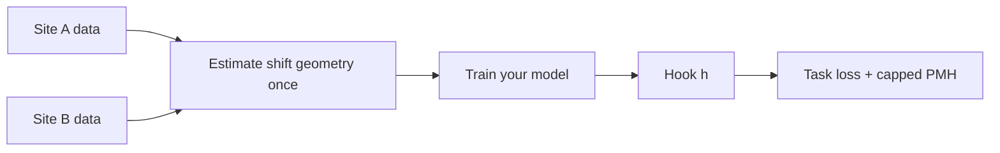

# matching-pmh

**Train on site A. Deploy on site B. Same labels.**

Estimate deployment geometry once → train with capped PMH → compare **matched / wrong-W / isotropic** on a **deploy holdout** before you trust gains.

[](https://pypi.org/project/matching-pmh/)
[](https://pypi.org/project/matching-pmh/)
[](https://github.com/vishalstark512/matching-pmh/blob/main/LICENSE)
[](https://github.com/vishalstark512/matching-pmh/actions/workflows/ci.yml)

[PyPI](https://pypi.org/project/matching-pmh/) · [GitHub](https://github.com/vishalstark512/matching-pmh) · **[Docs](https://vishalstark512.github.io/matching-pmh/)** · [Five-step recipe](docs/FIVE_STEP_RECIPE.md) · [](https://colab.research.google.com/github/vishalstark512/matching-pmh/blob/main/notebooks/domain_shift_first_run.ipynb)

---

## Adopt in 60 seconds

**→ [ADOPT.md](ADOPT.md)** (same checklist, zero noise)

```bash
pip install matching-pmh torch
pmh-train doctor
pmh-train evaluate --demo
```

| Step | Do this |
|------|---------|
| 1 | `python examples/00_first_run_domain_shift.py` or Colab |
| 2 | `pmh-train route --task YOUR_TASK` |
| 3 | Copy **one** [golden path](docs/GOLDEN_PATHS.md) (G1–G4) |
| 4 | Step 5 on deploy holdout (`evaluate_*` or `pmh-train evaluate`) |
| 5 | [Parameters cheat sheet](docs/PARAMETERS_CHEATSHEET.md) if tuning |

[`nuisance=` = deployment shift type](docs/WHAT_IS_DEPLOYMENT_SHIFT.md) · Evidence walkthroughs: [daily AI map](docs/walkthroughs/DAILY_AI_USE.md)

---

## Install

```bash
pip install matching-pmh
pip install "matching-pmh[sklearn]"   # frozen features / G2
pip install "matching-pmh[hf]"        # LLM corpora or style pairs
pip install "matching-pmh[lightning]" # G1b
```

---

## Who this is for

| You are doing… | Start here |
|----------------|------------|
| Pose / keypoints, new camera | `pmh-train route --task pose_or_keypoints` |
| Vision classification / fine-tune | `pmh-train route --task vision_classification` |
| Frozen `.npy` / sklearn | `pmh-train route --task frozen_embeddings_sklearn` |
| LLM style/format drift | `pmh-train route --task llm_style_or_format` |
| Not sure | `pmh-train shifts` then [five-step recipe](docs/FIVE_STEP_RECIPE.md) |

**Not for:** new test-time classes, unrelated label definitions, or “make any model robust to everything.”

---

## Minimal code (Tier 0)

```python
from pmh import (
    check_applicability,
    evaluate_baseline_vs_pmh,
    evaluate_robust_fit,
    robust_fit,
)

# PyTorch — estimate + train + optional Step 5
print(check_applicability(stack="pytorch", n_source=500, n_target=400).summary())
out = robust_fit(
    model, train_loader,
    source_batches=src, target_batches=tgt,
    hook="auto", epochs=20,
)
report = evaluate_robust_fit(
    model, train_loader, val_loader,
    source_batches=src, target_batches=tgt,
    hook="auto", pmh_result=out,
)
print(report.summary())

# sklearn — frozen features + Step 5 (falsification on by default)
report = evaluate_baseline_vs_pmh(x_source, y_source, x_target, y_target)
print(report.summary())
```

Copy-paste templates: [templates/matching-pmh-starter/](templates/matching-pmh-starter/) · Examples: [examples/](examples/) · `pmh-train wizard`

---

## CLI (common)

| Command | Purpose |
|---------|---------|
| `pmh-train doctor` | Install check + pipeline checklist |
| `pmh-train shifts` | Plain English shift types (`nuisance=` keys) |
| `pmh-train evaluate --demo` | G2 Step 5 smoke test |
| `pmh-train route --task ID` | Your task walkthrough |
| `pmh-train recipe` | Full five-step recipe text |

---

## How it works



Same hook for estimate and train. Optional depth: [vs CORAL](docs/COMPARE_TO_CORAL.md) · [Theory](docs/THEORY.md).

---

## API tiers

| Tier | Who | Import |
|------|-----|--------|
| **0 — Adopt** | First integration | `from pmh import robust_fit, PMHMatcher, evaluate_baseline_vs_pmh, …` — see `pmh.__all__` |
| **1 — Integrate** | Wiring + ship | `PMHLoss`, `estimate_from_config`, `compare_arms`, … |
| **2 — Evidence** | Paper replication | `pmh.evidence`, benchmarks, walkthroughs |

Map: [META_STRUCTURE.md](docs/META_STRUCTURE.md).

---

## Documentation

| I want to… | Read |
|------------|------|
| Plain English (“nuisance”?) | [WHAT_IS_DEPLOYMENT_SHIFT.md](docs/WHAT_IS_DEPLOYMENT_SHIFT.md) |
| Product spine | [FIVE_STEP_RECIPE.md](docs/FIVE_STEP_RECIPE.md) |
| My task | [APPLICATIONS.md](docs/APPLICATIONS.md) |
| Code to copy | [GOLDEN_PATHS.md](docs/GOLDEN_PATHS.md) |
| Install / CLI / folders | [INTEGRATE.md](docs/INTEGRATE.md) |
| Parameters | [PARAMETERS_CHEATSHEET.md](docs/PARAMETERS_CHEATSHEET.md) |
| Will it help? | [WHEN_PMH_HELPS.md](docs/WHEN_PMH_HELPS.md) |
| Paper / benchmarks | [walkthroughs](docs/walkthroughs/index.md) (optional) |

---

## Appendix (not for day one)

**D1–D7** — estimator IDs for the same geometry under different shift assumptions. Use `suggest_nuisance` or `pmh-train list-methods`; details in [NUISANCE_SUBTYPES.md](docs/NUISANCE_SUBTYPES.md).

**T1–T7** — paper replication presets: `pmh-train list-presets` · [PAPER_ALIGNMENT.md](docs/PAPER_ALIGNMENT.md).

---

## Citation

```bibtex
@software{matching_pmh,
  title  = {matching-pmh: Matched PMH training from estimated deployment nuisance geometry},
  author = {Rajput, Vishal},
  year   = {2026},
  url    = {https://github.com/vishalstark512/matching-pmh}
}
```

## License

MIT — see [LICENSE](https://github.com/vishalstark512/matching-pmh/blob/main/LICENSE).
