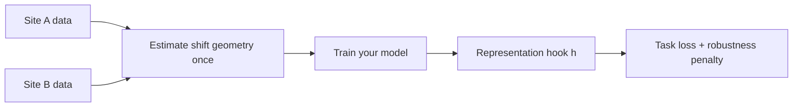

# matching-pmh

**Train on site A. Deploy on site B. Same labels.**

Add a domain-robustness regularizer to your PyTorch model or sklearn pipeline — without replacing your architecture or reading a research paper first.

[](https://pypi.org/project/matching-pmh/)
[](https://pypi.org/project/matching-pmh/)
[](https://github.com/vishalstark512/matching-pmh/blob/main/LICENSE)
[](https://github.com/vishalstark512/matching-pmh/actions/workflows/ci.yml)

[PyPI](https://pypi.org/project/matching-pmh/) · [GitHub](https://github.com/vishalstark512/matching-pmh) · **[Find your application](docs/APPLICATIONS.md)** · [Docs map](docs/MAP.md) · [](https://colab.research.google.com/github/vishalstark512/matching-pmh/blob/main/notebooks/domain_shift_first_run.ipynb)

---

## New here?

**[Find your application](docs/APPLICATIONS.md)** (nuisance + walkthrough) → **[Golden paths](docs/GOLDEN_PATHS.md)** (code) → `pmh-train route --task YOUR_TASK`

[Doc map — what to read and skip](docs/MAP.md)

## Developer API

```python
from pmh import check_applicability, explain_task, robust_fit

print(explain_task("pose_or_keypoints"))
print(check_applicability(stack="pytorch", n_source=500, n_target=400).summary())

# PyTorch: one call
out = robust_fit(model, train_loader, source_batches=src, target_batches=tgt, hook="auto", epochs=20)

# sklearn: baseline vs PMH on target holdout
report = evaluate_baseline_vs_pmh(x_source, y_source, x_target, y_target, compare_to=("coral",))
print(report.summary())

# PyTorch: same report shape on val_loader
report = evaluate_robust_fit(model, train_loader, val_loader, source_batches=src, target_batches=tgt, hook="auto", epochs=10)
print(report.summary())
```

**Route your task:** `pmh-train route --search pose` · `pmh-train route --task pose_or_keypoints` · [GOLDEN_PATHS.md](docs/GOLDEN_PATHS.md) · `pmh-train wizard`

---

## Who this is for

| You are doing… | Start here |
|----------------|------------|
| Pose / keypoints, new camera | `pmh-train route --task pose_or_keypoints` |
| Vision classification / fine-tune | `pmh-train route --task vision_classification` |
| Frozen `.npy` / sklearn | `pmh-train route --task frozen_embeddings_sklearn` |
| LLM style/format drift | `pmh-train route --task llm_style_or_format` |
| Not sure | [START_HERE.md](docs/START_HERE.md) (3 gates) |

**Not for:** new test-time classes, unrelated label definitions, or “make any model robust to everything.”

[When PMH helps (honest expectations) →](docs/WHEN_PMH_HELPS.md) · [What is PMH →](docs/WHAT_IS_PMH.md)

---

## 5-minute try

[](https://colab.research.google.com/github/vishalstark512/matching-pmh/blob/main/notebooks/domain_shift_first_run.ipynb)  
or locally:

```bash
pip install matching-pmh torch
git clone https://github.com/vishalstark512/matching-pmh.git
cd matching-pmh
python examples/00_first_run_domain_shift.py
```

You get **baseline vs PMH target accuracy** on synthetic data, then copy the pattern into your project.

Expected output: [docs/DEMO_OUTPUT.md](docs/DEMO_OUTPUT.md)

```bash
pmh-train wizard
```

---

## Default integration (PyTorch)

```python
from pmh import PMHTrainer, PMHConfig

trainer = PMHTrainer(
    model,
    hook=backbone,
    head=classifier,
    nuisance="domain_shift",
    pmh_config=PMHConfig.balanced(),
    artifact_path="artifacts/my_run.pt",
)
trainer.fit(
    train_loader,
    source_batches=source_loader,
    target_batches=target_loader,
    epochs=20,
)
```

## sklearn `Pipeline` (frozen features)

You already have embeddings `x_source`, `x_target` (same dimension). Adapt, then classify — like any other preprocessing step:

```python
pip install "matching-pmh[sklearn]"

from pmh import PMHMatcher
from sklearn.pipeline import Pipeline
from sklearn.linear_model import LogisticRegression

pipe = Pipeline([
    ("adapt", PMHMatcher(nuisance="domain_shift").fit(x_source, x_target)),
    ("clf", LogisticRegression(max_iter=500)),
])
pipe.fit(x_source, y_source)
# Score on held-out TARGET rows — not source-only accuracy
```

[Gallery: tabular](docs/gallery/tabular.md) · `examples/06_office31_sklearn.py`

---

## How it works (30 seconds)



Same hook layer for estimate and train. [Docs home](docs/index.md) · [First hour](docs/FIRST_HOUR.md) · [Troubleshooting glossary](docs/TROUBLESHOOTING.md#plain-language-glossary)

---

## How it relates to CORAL / domain adaptation

PMH keeps your task loss and penalizes sensitivity in representation space along directions that differ between train and deploy environments. See [vs CORAL](docs/COMPARE_TO_CORAL.md).

Under the hood: estimate deployment geometry once, train with an extra matched penalty on hook `h`. Details are optional: [Theory](docs/THEORY.md).

---

## Documentation

**Start:** [docs/index.md](docs/index.md) (reading order) → [D1–D7 subtypes](docs/NUISANCE_SUBTYPES.md) → [Golden paths](docs/GOLDEN_PATHS.md)

| I want to… | Read |
|------------|------|
| Will it help? | [WHEN_PMH_HELPS.md](docs/WHEN_PMH_HELPS.md) |
| Integrate my repo | [GETTING_STARTED.md](docs/GETTING_STARTED.md) |
| Paper / benchmarks | [PAPER_ALIGNMENT.md](docs/PAPER_ALIGNMENT.md) · [walkthroughs](docs/walkthroughs/index.md) |

---

## Install

```bash
pip install matching-pmh
pip install "matching-pmh[sklearn]"   # classical ML path
pip install "matching-pmh[vision]"    # ResNet / timm examples
pip install "matching-pmh[hf]"        # LLM style shift
```

---

## Advanced (estimators D1–D7, research)

The Grand Unification paper unifies many nuisance estimators (subspace, domain Gram, augmentations, style, …). The library exposes them when your shift story is not plain cross-domain:

```bash
pmh-train list-methods
pmh-train list-presets
```

| Research / benchmark | Doc |
|----------------------|-----|
| Paper block presets | [paper-presets-by-block.md](docs/walkthroughs/paper-presets-by-block.md) |
| Office-31 reference table | [BENCHMARKS.md](docs/BENCHMARKS.md) |
| Lemma-level math | [THEORY.md](docs/THEORY.md) |

---

## Citation

```bibtex
@software{matching_pmh,
  title  = {matching-pmh: Matched PMH training from estimated deployment nuisance geometry},
  author = {Rajput, Vishal},
  year   = {2026},
  url    = {https://github.com/vishalstark512/matching-pmh}
}
```

## License

MIT — see [LICENSE](https://github.com/vishalstark512/matching-pmh/blob/main/LICENSE).
