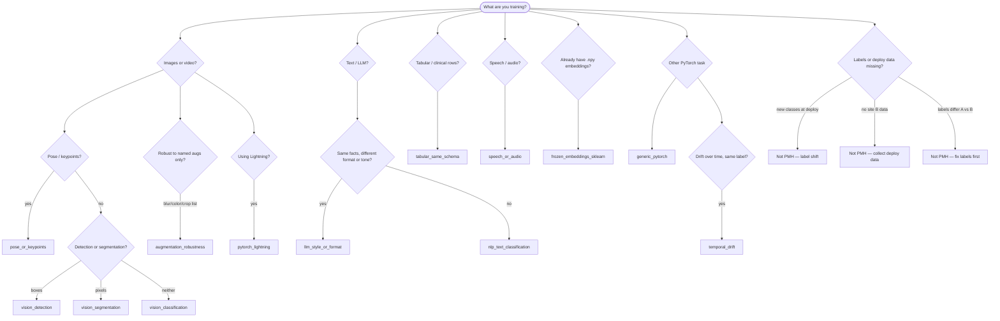

# Find your application

**Zero prior knowledge of D1–D7 required.**

## In 60 seconds

| Step | Do this |
|------|---------|
| 1 | **Find yourself** in the [finder table](#application-finder) or run `pmh-train route --search hospital` |
| 2 | Read **what changes** (the nuisance) in that section — that is what PMH adapts to |
| 3 | Follow the **7-step walkthrough** in the same section |
| 4 | Copy full code from [Golden paths](GOLDEN_PATHS.md) (one of G1–G4) |

PMH is **not** “make my model robust to everything.” It targets **one named deploy shift** while your labels stay valid.

```bash
pip install matching-pmh
pmh-train route --search pose          # keyword finder
pmh-train route --task pose_or_keypoints
pmh-train route --list                 # all shift types + apps
```

```python
from pmh import explain_task, format_search_results, search_applications

print(format_search_results("hospital"))
print(explain_task("pose_or_keypoints"))
```

---

## Which application? (decision tree)



**None of the boxes fit?** See [Not PMH — use something else](#not-pmh) at the bottom.

| If the tree points to… | Command |
|------------------------|---------|
| Pose | `pmh-train route --task pose_or_keypoints` |
| Classification | `pmh-train route --task vision_classification` |
| Detection | `pmh-train route --task vision_detection` |
| Segmentation | `pmh-train route --task vision_segmentation` |
| Text classifier | `pmh-train route --task nlp_text_classification` |
| LLM style | `pmh-train route --task llm_style_or_format` |
| Tabular | `pmh-train route --task tabular_same_schema` |
| Speech | `pmh-train route --task speech_or_audio` |
| Frozen `.npy` | `pmh-train route --task frozen_embeddings_sklearn` |
| Named augmentations | `pmh-train route --task augmentation_robustness` |
| Temporal drift | `pmh-train route --task temporal_drift` |
| PyTorch Lightning | `pmh-train route --task pytorch_lightning` |
| Compositional (part of h) | `pmh-train route --task compositional_coordinates` |
| Other | `pmh-train route --task generic_pytorch` |

---

## By training stack (after you pick nuisance)

| You use… | Golden path | When |
|----------|-------------|------|
| Plain PyTorch / `robust_fit` | [G1](GOLDEN_PATHS.md#g1) | Default |
| PyTorch Lightning | [G1b](GOLDEN_PATHS.md#g1b) or [Lightning section](#pytorch_lightning) | `LightningModule` |
| Frozen features + sklearn | [G2](GOLDEN_PATHS.md#g2) | `.npy` rows |
| HF corpora / `HFPMHTrainer` | [G3](GOLDEN_PATHS.md#g3) | Two text domains |
| HF `transformers.Trainer` | [G3b](GOLDEN_PATHS.md#g3b) | DPO / LoRA / SFT |
| Your own Σ̂ / deltas | [G4](GOLDEN_PATHS.md#g4) | Precomputed geometry |

---

## What is the “nuisance”?

**Nuisance** = what changes between **train site A** and **deploy site B** while the **label keeps the same meaning**.

| Stays the same | Changes (what PMH targets) |
|----------------|----------------------------|
| Class names, keypoint index #3, ICD code | Camera, hospital, mic, markdown style |
| “Positive” still means the same disease | Lighting, texture, cohort mix, tone |

PMH keeps your **task loss** (pose L2, CE, segmentation loss, …). It only regularizes a representation `h` so the model is less sensitive along those changing directions.

---

## Shift type (plain English → library name)

| You notice… | Plain name | Library |
|-------------|------------|---------|
| Looks / sounds / rows **different**, labels unchanged | Site / sensor shift | D4 `domain_shift` |
| Same classes, labels on **both** sites | Cross-site class geometry | D1 `subspace` |
| LLM: same facts, different **format** | Style / surface | D7 `style` |
| Named augmentations you can generate | Known transforms | D3 `augmentation` |
| Nuisance in **part** of the vector | Indexed coordinates | D5 `compositional` |
| Drift **over time**, same entity label | Temporal | D6 `temporal` |

Reference: [NUISANCE_SUBTYPES.md](NUISANCE_SUBTYPES.md).

---

## Application finder

<a id="application-finder"></a>

| Application | What changes (nuisance) | Fit | Section |
|-------------|-------------------------|-----|---------|
| Pose / keypoints | Camera / studio look | **YES** | [↓](#pose_or_keypoints) |
| Image classification | New camera / site | **YES** | [↓](#vision_classification) |
| Object detection | Scene on backbone | **TRY** | [↓](#vision_detection) |
| Segmentation | Texture / sensor | **TRY** | [↓](#vision_segmentation) |
| Text classification | Channel / wording | **YES** | [↓](#nlp_text_classification) |
| LLM format / tone | Markdown / template | **YES** | [↓](#llm_style_or_format) |
| Tabular / clinical | Hospital cohort | **YES** | [↓](#tabular_same_schema) |
| Speech / audio | Mic / room / codec | **YES** | [↓](#speech_or_audio) |
| Frozen `.npy` | Feature distribution | **YES** | [↓](#frozen_embeddings_sklearn) |
| **Named augmentations** | Blur, color, crop, … | **YES** | [↓](#augmentation_robustness) |
| **Temporal drift** | Sensor drift over time | **YES** | [↓](#temporal_drift) |
| **PyTorch Lightning** | (same as your task) | **YES** | [↓](#pytorch_lightning) |
| **Compositional coords** | Part of h only | **YES** | [↓](#compositional_coordinates) |
| Other PyTorch | Env shift + hook `h` | **TRY** | [↓](#generic_pytorch) |

**Search:** `pmh-train route --search blur` · `hospital` · `llm` · `temporal`

**YES** = usual fit · **TRY** = validate on deploy metric; often backbone-only first.

---

<a id="pose_or_keypoints"></a>

## Pose / keypoints

**Sounds like**

- Fine-tune pose on studio A → deploy on hospital camera B  
- Same 17 COCO keypoints, different RGB or viewpoint  
- Depth/RGB pose model, new scanner site  

| | |
|--|--|
| **Nuisance** | Lighting, viewpoint, sensor — **not** what joint #7 means |
| **Subtype** | D4 `domain_shift` |
| **Golden path** | [G1 PyTorch](GOLDEN_PATHS.md#g1) |
| **Not for** | Different skeleton, new joints at deploy, no deploy frames |

**Walkthrough**

1. Confirm **same keypoint names and count** on train and deploy.  
2. `pip install matching-pmh torch` · `pmh-train doctor`  
3. `train_loader` = labeled site A; `deploy_loader` = site B (**unlabeled OK** for estimate).  
4. `hook = suggest_hook(model).hook` on **backbone** (before heatmap / coord head).  
5. `robust_fit(..., source_batches=A, target_batches=B)` — **keep** L2 / OKS / wing loss.  
6. Read `preflight` (pass / marginal); evaluate pose metric on **deploy holdout**.  
7. [Falsification controls](walkthroughs/08-falsification-controls.md) before production claims.  

```python
from pmh import check_applicability, robust_fit, suggest_hook

print(check_applicability(stack="pytorch", n_source=N_A, n_target=N_B).summary())
hook = suggest_hook(model).hook
out = robust_fit(
    model, train_loader,
    source_batches=loader_a, target_batches=loader_b,
    hook=hook, epochs=20,
)
```

---

<a id="vision_classification"></a>

## Image classification

**Sounds like**

- ResNet/ViT on warehouse photos → store photos, same SKU labels  
- Chest X-ray: scanner A train, scanner B deploy, same pathology classes  
- Phone vs DSLR, same defect classes on a factory line  

| | |
|--|--|
| **Nuisance** | Visual **appearance** (camera, geography, device) |
| **Subtype** | D4 `domain_shift` |
| **Golden path** | [G1](GOLDEN_PATHS.md#g1) |
| **Not for** | New classes only at deploy; “positive” means different things per site |

**Walkthrough**

1. Write down class list — must match **exactly** on A and B (spelling + semantics).  
2. Collect images from deploy site B (labels optional for geometry estimate).  
3. `suggest_hook(model)` → backbone or pooler **before** classifier.  
4. `robust_fit(model, train_loader, source_batches=A, target_batches=B, hook=hook)`.  
5. Compare **deploy holdout accuracy** ERM vs PMH (not train accuracy alone).  
6. If preflight is `marginal`, add more B batches or lower `rank`.  
7. [Controls](walkthroughs/08-falsification-controls.md) before claiming PMH helped.  

```python
from pmh import robust_fit, suggest_hook

hook = suggest_hook(model).hook
out = robust_fit(
    model, train_loader,
    source_batches=loader_site_a, target_batches=loader_site_b,
    hook=hook, head=classifier, epochs=20,
)
```

---

<a id="vision_detection"></a>

## Object detection

**Sounds like**

- YOLO trained daytime dashcam → deploy night camera, same COCO classes  
- Industrial inspector: line A vs line B cameras, same defect categories  
- Person detector: country A train, country B deploy  

| | |
|--|--|
| **Nuisance** | Scene **look** on the **shared backbone** (not box matching logic) |
| **Subtype** | D4 `domain_shift` |
| **Golden path** | [G1](GOLDEN_PATHS.md#g1) — backbone / FPN only |
| **Not for** | Different category list per region; PMH does not fix anchor matching |

**Walkthrough**

1. Confirm **same class IDs** for boxes on train and deploy.  
2. Identify hook: **FPN output** or backbone tensor fed to the detection head.  
3. Build `source_batches` / `target_batches` = image tensors (or feature tensors) per site — no box labels needed for estimate.  
4. Apply PMH on that hook; **leave** localization + classification losses as-is.  
5. Fine-tune with your usual detection loop (or `robust_fit` if model is one `nn.Module`).  
6. Evaluate **mAP on deploy holdout** — PMH helps most when ERM mAP is already weak on B.  
7. Controls on backbone shift before production.  

```python
# Same pattern as classification — hook = backbone or FPN, not per-anchor head
from pmh import robust_fit, suggest_hook

hook = suggest_hook(detector.backbone).hook
out = robust_fit(
    detector, train_loader,
    source_batches=loader_region_a, target_batches=loader_region_b,
    hook=hook, epochs=20,
)
```

---

<a id="vision_segmentation"></a>

## Semantic segmentation

**Sounds like**

- Road/person segmentation: maps from city A → deploy city B weather  
- Medical organ segmentation: hospital A scanner → hospital B  
- Satellite: sensor A → sensor B, same land-cover classes  

| | |
|--|--|
| **Nuisance** | Texture, color, sensor — **not** per-pixel class IDs |
| **Subtype** | D4 `domain_shift` |
| **Golden path** | [G1](GOLDEN_PATHS.md#g1) on encoder / bottleneck |
| **Not for** | New “stuff” classes only at deploy |

**Walkthrough**

1. Confirm **same label map** (class id 3 = same concept on A and B).  
2. Hook = **encoder output** or U-Net bottleneck (before decoder upsampling).  
3. `source_batches` = images site A; `target_batches` = images site B (unlabeled OK).  
4. Train with your **pixel CE / Dice** unchanged; PMH penalizes `h` only.  
5. Evaluate **mIoU on deploy** holdout vs ERM baseline.  
6. Tune `rank` if preflight marginal; more B images usually stabilizes estimate.  
7. Controls before production.  

```python
from pmh import robust_fit, suggest_hook

hook = suggest_hook(model.encoder).hook  # or "bottleneck" path in your U-Net
out = robust_fit(
    model, train_loader,
    source_batches=loader_a, target_batches=loader_b,
    hook=hook, epochs=20,
)
```

---

<a id="nlp_text_classification"></a>

## Text classification

**Sounds like**

- BERT on support emails → deploy on in-app chat, same 5 intents  
- Toxicity model: forum A → forum B, same label definitions  
- Product categorization: vendor copy A → vendor copy B  

| | |
|--|--|
| **Nuisance** | **Channel / wording**, not intent meaning |
| **Subtype** | D4 `domain_shift` |
| **Golden path** | [G1](GOLDEN_PATHS.md#g1) + HF encoder |
| **Not for** | New intents at deploy; topic drift that changes label meaning |

**Walkthrough**

1. Freeze label set — intent #2 must mean the same on A and B.  
2. `pip install "matching-pmh[hf]"` · build text loaders for corpus A and B.  
3. Hook = **pooler** or last hidden state before linear classifier.  
4. `robust_fit` with `source_batches` / `target_batches` (B can be unlabeled).  
5. Evaluate accuracy on **labeled deploy holdout**.  
6. If deploy is mostly new phrasing but same intents → good fit; if new intents appear → stop.  
7. Controls before rollout.  

```python
pip install "matching-pmh[hf]"
from pmh import robust_fit

out = robust_fit(
    model, train_loader,
    source_batches=loader_corpus_a, target_batches=loader_corpus_b,
    hook=model.pooler, epochs=3,
)
```

---

<a id="llm_style_or_format"></a>

## LLM format / tone (same facts)

**Sounds like**

- SFT on formal reports → production chat-style bullets, same answers  
- Same QA JSON, customer changes wrapper template  
- DPO on one markdown style → deploy system renders HTML  

| | |
|--|--|
| **Nuisance** | **Surface form** (markdown, tone, JSON layout) |
| **Subtype** | D7 `style` |
| **Golden path** | [G3](GOLDEN_PATHS.md#g3) or [G3b](GOLDEN_PATHS.md#g3b) with `Trainer` |
| **Not for** | New facts, policy-only changes, factual drift |

**Walkthrough**

1. Build **style pairs**: same content, two surfaces (`style_a` / `style_b` in JSONL).  
2. `pip install "matching-pmh[hf]"` · `pmh-train doctor --stack hf`  
3. `PMHTrainer(model, nuisance='style', pmh_config=PMHConfig.balanced())`  
4. `trainer.estimate(style_jsonl='pairs.jsonl', model_id=YOUR_MODEL)`  
5. `trainer.fit(your_sft_or_dpo_loader)` — keep preference / CE loss.  
6. Evaluate on deploy-formatted holdout (same facts, new template).  
7. Already on `transformers.Trainer`? → [G3b](GOLDEN_PATHS.md#g3b) instead.  

```python
from pmh import PMHTrainer, PMHConfig

trainer = PMHTrainer(model, hook=hook, nuisance="style", pmh_config=PMHConfig.balanced())
trainer.estimate(style_jsonl="pairs.jsonl", model_id="meta-llama/Llama-3.2-1B")
trainer.fit(train_loader, epochs=3)
```

---

<a id="tabular_same_schema"></a>

## Tabular / clinical (same columns)

**Sounds like**

- Readmission model: hospital A train → hospital B deploy, same ICD codes  
- Credit risk: country A features → country B, same column schema  
- Same lab tests, new cohort prevalence  

| | |
|--|--|
| **Nuisance** | **Cohort / hospital** distribution in fixed columns |
| **Subtype** | D1 `subspace` (often best with labels on both sides) |
| **Golden path** | [G2 sklearn](GOLDEN_PATHS.md#g2) |
| **Not for** | New columns only at B; disease definition changed |

**Walkthrough**

1. Verify **column names and meanings** match A and B.  
2. Build `x_source`, `y_source` from A; `x_target` from B (labels on B help for D1).  
3. `pip install "matching-pmh[sklearn]"`  
4. `PMHMatcher(nuisance='subspace').fit(x_source, x_target)` inside sklearn `Pipeline`.  
5. `evaluate_baseline_vs_pmh(..., compare_to=('coral',))` on B holdout.  
6. Report both accuracy **and** that matched beats wrong-W in controls.  
7. Need end-to-end neural encoder? → extract embeddings first or use [G1](GOLDEN_PATHS.md#g1).  

```python
from pmh import evaluate_baseline_vs_pmh

report = evaluate_baseline_vs_pmh(
    x_source, y_source, x_target, y_target, compare_to=("coral",)
)
print(report.summary())
```

---

<a id="speech_or_audio"></a>

## Speech / audio

**Sounds like**

- ASR: studio mic train → phone deploy, same vocabulary  
- Keyword spotting: office mic → factory floor  
- Bioacoustics: sensor A → sensor B, same species labels  

| | |
|--|--|
| **Nuisance** | **Acoustic channel** (mic, room, codec) |
| **Subtype** | D4 `domain_shift` |
| **Golden path** | [G1](GOLDEN_PATHS.md#g1) on acoustic encoder |
| **Not for** | New language or vocabulary at deploy |

**Walkthrough**

1. Confirm **word / class labels** mean the same on A and B.  
2. Hook = wav2vec / spectrogram **encoder** before CTC or classifier head.  
3. `source_batches` = audio chunks site A; `target_batches` = site B (transcripts on A for task loss).  
4. `robust_fit` — keep CTC / CE loss unchanged.  
5. Evaluate WER or accuracy on **deploy holdout**.  
6. More B audio usually fixes marginal preflight.  
7. Controls before shipping.  

```python
from pmh import robust_fit, suggest_hook

hook = suggest_hook(model.encoder).hook
out = robust_fit(
    model, train_loader,
    source_batches=loader_mic_a, target_batches=loader_mic_b,
    hook=hook, epochs=20,
)
```

---

<a id="frozen_embeddings_sklearn"></a>

## Frozen `.npy` embeddings

**Sounds like**

- Already ran ResNet and saved `features.npy` for two cameras  
- No budget to fine-tune CNN — only adapt a linear head  
- PMH on precomputed transformers embeddings per document  

| | |
|--|--|
| **Nuisance** | **Feature distribution** between folders |
| **Subtype** | D4 `domain_shift` (D1 if labeled on both sides) |
| **Golden path** | [G2](GOLDEN_PATHS.md#g2) |
| **Not for** | You still need to fine-tune the encoder (use G1) |

**Walkthrough**

1. One folder per site: `features.npy` (+ optional `labels.npy`) — see [DATA_LAYOUT.md](DATA_LAYOUT.md).  
2. `pmh-train estimate --source-dir site_a --target-dir site_b -o artifacts/sigma`  
3. `PMHMatcher(nuisance='domain_shift').fit(x_a, x_b)` in a sklearn `Pipeline`.  
4. Train classifier on **source** rows; test on **target** holdout.  
5. `evaluate_baseline_vs_pmh` for a one-line ERM vs PMH report.  
6. Honest check: on frozen features PMH may tie CORAL — see [WHEN_PMH_HELPS.md](WHEN_PMH_HELPS.md).  
7. If you need encoder movement → switch to [G1](GOLDEN_PATHS.md#g1).  

```python
from pmh import evaluate_baseline_vs_pmh

report = evaluate_baseline_vs_pmh(x_source, y_source, x_target, y_target, compare_to=("coral",))
print(report.summary())
```

Full pipeline pattern: [G2](GOLDEN_PATHS.md#g2).

---

<a id="augmentation_robustness"></a>

## Named augmentations (blur, color, crop, …)

**Sounds like**

- Train with blur + color jitter + noise — want **less sensitivity** to those modes  
- Photometric policy you can enumerate (not a mystery new camera)  
- “Same as our aug stack” robustness, not domain adaptation to site B  

| | |
|--|--|
| **Nuisance** | **Listed transforms** you can apply in code |
| **Subtype** | D3 `augmentation` |
| **Golden path** | [G1](GOLDEN_PATHS.md#g1) + `PMHLoss` |
| **Not for** | New deploy camera unrelated to your aug list → use [classification](#vision_classification) + site B |

**Walkthrough**

1. Write the finite list of modes (e.g. `blur`, `jpeg`, `brightness`).  
2. On a reference batch: `delta_m = mean(encoder(aug_m(x)) - encoder(x))`.  
3. Stack deltas → `estimate_from_config(SigmaTaskConfig.for_augmentation(), aug_deltas=stack)`.  
4. Add `PMHLoss(artifact, pmh_config)` to your training loop with task loss.  
5. Validate on **clean** val (not only heavily augmented val).  
6. If deploy risk is a **new site**, also collect site B and consider D4.  
7. Run `python examples/18_augmentation_d3.py` once to see the pattern.  

```python
from pmh import SigmaTaskConfig, estimate_from_config, PMHConfig, PMHLoss

art = estimate_from_config(SigmaTaskConfig.for_augmentation(), aug_deltas=aug_stack)
pmh_loss = PMHLoss(art, PMHConfig.balanced())
# training_step: loss = task_loss + pmh_term
```

---

<a id="temporal_drift"></a>

## Temporal drift (sequences)

**Sounds like**

- ICU vitals: same patient label, measurements drift over days  
- Wearable windows `[T, d]` per subject  
- Representations change over time but **entity label** fixed  

| | |
|--|--|
| **Nuisance** | **Time** axis drift, not a new camera per se |
| **Subtype** | D6 `temporal` |
| **Golden path** | [G1](GOLDEN_PATHS.md#g1) + sequence API |
| **Not for** | Independent images with no time order |

**Walkthrough**

1. Organize batches as `[N, T, d]` (T ≥ 2) with one label per sequence.  
2. `collect_sequence_features(model, loader, hook)` or your own tensor.  
3. `estimate_from_config(SigmaTaskConfig.for_temporal(rank=16), sequences)`.  
4. Add PMH penalty during training; keep sequence loss.  
5. Evaluate on **future** time holdout.  
6. Deep dive: [walkthrough 11 — temporal D6](walkthroughs/11-temporal-d6.md).  
7. [Falsification controls](walkthroughs/08-falsification-controls.md).  

```python
from pmh import SigmaTaskConfig, estimate_from_config

art = estimate_from_config(SigmaTaskConfig.for_temporal(rank=16), sequence_feats)
```

---

<a id="pytorch_lightning"></a>

## PyTorch Lightning

**Sounds like**

- You already have `LightningModule` + `Trainer`  
- Same domain A/B story as [classification](#vision_classification) or [pose](#pose_or_keypoints)  

| | |
|--|--|
| **Nuisance** | Whatever your underlying task is (usually D4 site shift) |
| **Subtype** | Same as underlying task |
| **Golden path** | [G1b](GOLDEN_PATHS.md#g1b) |
| **Not for** | Plain script — use [G1](GOLDEN_PATHS.md#g1) `robust_fit` |

**Walkthrough**

1. Pick nuisance from sections above (camera, style, …).  
2. `pip install "matching-pmh[lightning]"`  
3. Phase A: `h_a`, `h_b` from backbone on A/B batches → `estimate_from_config`.  
4. `PMHLoss` + `add_pmh_to_loss` inside `training_step`.  
5. `PMHLightningCallback.from_artifact` for warmup/cap.  
6. Template: [lightning_g1b_minimal.py](https://github.com/vishalstark512/matching-pmh/blob/main/templates/matching-pmh-starter/lightning_g1b_minimal.py)  
7. Example: `examples/09_lightning_module.py`  

---

<a id="compositional_coordinates"></a>

## Compositional coordinates (part of h)

**Sounds like**

- QM9-style features: only **some columns** are molecular geometry  
- Code model: nuisance lives in **token blocks**, not whole embedding  
- Pose vector: known subset of indices affected by site  

| | |
|--|--|
| **Nuisance** | **Indexed coordinates** in h, not global appearance |
| **Subtype** | D5 `compositional` |
| **Golden path** | [G1](GOLDEN_PATHS.md#g1) + `nuisance_indices` |
| **Not for** | Whole-camera shift — use [classification](#vision_classification) (D4) |

**Walkthrough**

1. List `nuisance_indices` (ints or ranges) — what moves with deploy?  
2. Build feature matrix `[N, d]` from your encoder.  
3. `SigmaTaskConfig.for_compositional(nuisance_indices=...)` → `estimate_from_config`.  
4. Train with PMH on full h; penalty uses compositional subspace only.  
5. Examples: `examples/16_qm9_molecule_d5.py`, walkthroughs [05](walkthroughs/05-compositional-d5.md), [14](walkthroughs/14-qm9-molecule-d5.md).  
6. [Lemma detail](estimators/d5.md).  
7. [Falsification controls](walkthroughs/08-falsification-controls.md).  

```python
from pmh import SigmaTaskConfig, estimate_from_config

cfg = SigmaTaskConfig.for_compositional(nuisance_indices=[0, 1, 2, 8, 9])
art = estimate_from_config(cfg, features)
```

---

<a id="generic_pytorch"></a>

## Other PyTorch (regression, multi-task, RL, …)

**Sounds like**

- Custom regression head, factory sensor changes between plants  
- Multi-task net: deploy site changes input distribution, same targets  
- Any model where you can name “site A” and “site B” batches  

| | |
|--|--|
| **Nuisance** | Environmental factor that changes `h` but not target definition |
| **Subtype** | Usually D4 `domain_shift` |
| **Golden path** | [G1](GOLDEN_PATHS.md#g1) |
| **Not for** | No deploy domain; i.i.d. data only |

**Walkthrough**

1. One sentence: what changes at deploy **without** changing the target? (If you cannot → [not PMH](#not-pmh)).  
2. `check_applicability(stack='pytorch', n_source=..., n_target=...)`  
3. Hook = last **shared** representation before task-specific heads.  
4. `source_batches` / `target_batches` from A and B.  
5. `robust_fit` — task loss unchanged.  
6. Deploy metric vs ERM.  
7. Controls.  

```python
from pmh import check_applicability, robust_fit

print(check_applicability(stack="pytorch", n_source=n_a, n_target=n_b).summary())
out = robust_fit(model, train_loader, source_batches=ba, target_batches=bb, hook="auto", epochs=20)
```

---

<a id="not-pmh"></a>

## Not PMH — use something else

| Your situation | Why not PMH | Instead |
|----------------|-------------|---------|
| **New classes** only at deploy | Label shift | Open-set, hierarchical heads, retrain |
| **No data** from site B | Cannot estimate nuisance | Collect unlabeled deploy data |
| **Labels mean different things** on A vs B | Not comparable | Harmonize labels, separate models |
| **“Robust to anything”** | No specific deploy story | Augmentation, adversarial training |
| **Only generic noise** | No cross-domain structure | Standard regularization |
| **Guaranteed +accuracy** | PMH is not a magic boost | [WHEN_PMH_HELPS.md](WHEN_PMH_HELPS.md) + controls |

Still unsure? `pmh-train wizard` or [START_HERE](START_HERE.md) three gates.

---

**Next:** [Golden paths](GOLDEN_PATHS.md) · [First hour](FIRST_HOUR.md) · [MAP](MAP.md)
