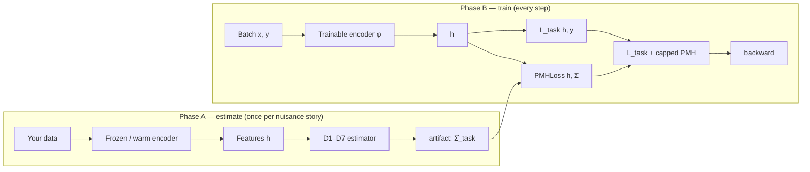

# Where PMH sits in your codebase

This page is the **practical** companion to [THEORY.md](THEORY.md). You keep your model, optimizer, and task loss. The library adds one object (an estimated matrix) and one extra term in the loss.

---

## Two phases (always)

| Phase | What you run | Output |
|-------|----------------|--------|
| **A. Estimate** | Forward data through a **fixed** encoder; run D1–D7 | `SigmaTaskEstimate` saved as `.pt` |
| **B. Train** | Your normal loop + `PMHLoss` on representations `h` | Updated weights |

You do **not** replace your trainer. You **add** a penalty on `h = φ_θ(x)` at a layer you choose.



**Where to hook `h`:** any differentiable tensor you treat as the representation—penultimate layer of a CNN, pooled ViT tokens, GNN node embeddings (with D5 indices), Transformer hidden state before the head, LoRA-adapted LM hidden states for D7.

---

## The maths (display form)

**Problem.** ERM minimizes prediction error on the training distribution. Gradients align features with **every** input direction that helps labels—including directions that are label-preserving deployment nuisances (lighting, site, sensor noise, answer formatting, renameable tokens, …).

**Object.** Fix a law $Q_n$ over nuisance vectors $n$ that describe **label-preserving** deployment variation. The target geometry is

$$
\Sigma_{\mathrm{task}} = \mathrm{Cov}_{Q_n}(n) \in \mathbb{R}^{d \times d}.
$$

**Repair.** Let $h = \phi_\theta(x) \in \mathbb{R}^d$. Matched PMH adds (schematically)

$$
\mathcal{L} = \mathcal{L}_{\mathrm{task}} + \lambda \,\mathbb{E}_x\left[\mathrm{Tr}\left(J_\phi(x)^\top J_\phi(x)\,\Sigma'\right)\right],
\qquad
\mathrm{range}(\Sigma') \supseteq \mathrm{range}(\Sigma_{\mathrm{task}}).
$$

The implementation applies a **finite-difference penalty on $h$** (not a full Jacobian), via `PMHLoss` and optional probes—see `pmh.penalty`.

**Unification.** CORAL, domain Gram matrices, augmentation stacks, metric-learning directions, adversarial subspaces, and style Grams for alignment are different **estimators** of the same $\Sigma_{\mathrm{task}}$ under assumptions $A_k$ (D1–D7). Matched PMH is one **loss family** with $\Sigma' \approx \hat\Sigma_{\mathrm{task}}$; isotropic PMH / generic VAT use $\Sigma' \propto I$.

---

## What you pass into the library

| You provide | Library provides |
|-------------|------------------|
| Batches $x$ (and $y$ when needed for estimation) | `collect_features`, estimators |
| `h` with `requires_grad` during train | `PMHLoss.capped_total(task_loss, h)` |
| Choice of D1–D7 | `SigmaTaskConfig`, `estimate_from_config` |
| Optional: JSONL style pairs (D7) | `pmh-train estimate --config …` |

---

## Pattern 1 — Plain PyTorch (any `nn.Module`)

Same structure as `examples/01_domain_shift_d4.py`.

```python
# --- Phase A: estimate (encoder eval, no PMH yet) ---
backbone.eval()
h_src = collect_features(backbone, source_loader, max_batches=50)
h_tgt = collect_features(backbone, target_loader, max_batches=50)
artifact = estimate_from_config(SigmaTaskConfig.for_domain(rank=32), h_src, h_tgt)
artifact.save("artifacts/sigma_d4")

# --- Phase B: train (encoder train, head + PMH) ---
pmh = PMHLoss(artifact, PMHConfig(weight=0.3, cap_ratio=0.3, warmup_epochs=2))
backbone.train()
for epoch in range(num_epochs):
    pmh.set_epoch(epoch)
    for x, y in train_loader:
        opt.zero_grad()
        h = backbone(x)                    # <-- hook here
        task = criterion(head(h), y)
        total, _ = pmh.capped_total(task, h)
        total.backward()
        opt.step()
```

**Adaptation:** replace `Backbone` with ResNet/ViT/GNN—only `h` shape `[B, d]` must match `artifact.dim`.

---

## Pattern 2 — CNN / ViT with a named layer

```python
class MyModel(nn.Module):
    def __init__(self):
        super().__init__()
        self.features = torchvision.models.resnet18(weights=None)
        self.features.fc = nn.Identity()
        self.head = nn.Linear(512, num_classes)

    def encode(self, x):
        return self.features(x)   # h: [B, 512]

    def forward(self, x):
        return self.head(self.encode(x))

model = MyModel()
# Phase A: h = model.encode(x) on source/target loaders (torch.no_grad() OK for collection)
# Phase B: h = model.encode(x); requires_grad True through encode during train
```

For **multi-scale** nuisances (D3/D4 at several layers), see `examples/07_vision_multilayer.py` and `MultiLayerPMHLoss`.

---

## Pattern 3 — Hugging Face `Trainer`

Use when you already train with `transformers`. **Estimate** still uses your model’s hidden states; **train** wraps `Trainer`.

```python
from transformers import TrainingArguments
from pmh.integrations.hf_trainer import get_pmh_trainer

PMHTrainer = get_pmh_trainer()

# Phase A: run model on batches, stack hidden states -> estimate_from_config(...)
artifact = estimate_from_config(SigmaTaskConfig.for_alignment(rank=16), h_style_a, h_style_b)

# Phase B:
trainer = PMHTrainer.from_artifact(
    artifact,
    PMHConfig(weight=0.2, cap_ratio=0.3, warmup_epochs=1),
    model=model,
    args=TrainingArguments(..., per_device_train_batch_size=8, num_train_epochs=3),
    train_dataset=dataset,
    representation_fn=lambda m, batch: m.model(
        input_ids=batch["input_ids"],
        attention_mask=batch.get("attention_mask"),
        output_hidden_states=True,
    ).hidden_states[-1].mean(dim=1),  # h: [B, d]
)
trainer.train()
```

Toy version: `examples/10_hf_trainer.py`.  
Full D7 + LoRA + JSONL: `examples/11_dpo_lora_style_pmh.py`.

**Important:** `representation_fn` must return the **same** $d$ and semantic layer you used when estimating $\hat\Sigma$.

---

## Pattern 4 — Compositional nuisance (GNN, tokens) → D5

Nuisance lives on a **subset of coordinates** (atoms, code tokens). Pass indices into the config; features are still `[N, d]` but the estimator blocks $\Sigma$ on those indices.

```python
nuisance_idx = [0, 1, 2, 5, 8]  # your coordinate story
cfg = SigmaTaskConfig.for_compositional(nuisance_idx)
artifact = estimate_from_config(cfg, h_with_nuisance_coords)
# Train: same PMHLoss(artifact, ...) on h from your GNN readout
```

See `examples/03_compositional_d5.py`.

---

## Pattern 5 — Sklearn / frozen features → D1 or D4

Train a classical head on top of frozen embeddings; estimate $\Sigma$ on `.numpy()` or `torch` features from source vs target.

```python
# h_source, h_target: [N, d] from your frozen encoder or sklearn pipeline
artifact = estimate_from_config(SigmaTaskConfig.for_subspace(rank=10), h_source, h_target)
# Fine-tune only head with PMH on h if you unfreeze later — see examples/06_office31_sklearn.py
```

---

## Pattern 6 — LLM style (D7) without rewriting DPO

1. Prepare `style_pairs.jsonl`: same `content_fixed`, different `style_variants`.
2. `pmh-train estimate --config examples/configs/d7_style_estimate.json`
3. Load artifact in your script; add `PMHLoss` on last hidden state **or** use `PMHTrainer` alongside preference loss.

Estimation uses the **base** or **warm** LM; training can use LoRA (`examples/11_dpo_lora_style_pmh.py`).

---

## Choosing the hook layer

| Goal | Typical `h` |
|------|-------------|
| Domain / site shift (D4) | Penultimate embedding before classifier |
| Photometric aug (D3) | Mid-level conv feature map (flattened) or multi-layer |
| LLM style (D7) | Mean-pooled last hidden state (fixed layer index) |
| Temporal drift (D6) | Sequence of $h_t$ along time; use temporal estimator API |

Rule of thumb: $h$ should be **where nuisance variation shows up** in feature space at deployment. Re-estimate if you change depth or pooling.

---

## Hyperparameters that matter

| Knob | Typical | Role |
|------|---------|------|
| `PMHConfig.weight` | 0.1–0.5 | Global PMH scale |
| `cap_ratio` | 0.3 | PMH term capped vs task loss (stable $\lambda$) |
| `warmup_epochs` | 1–5 | Ramp PMH after task loss stabilizes |
| `rank` (D1/D4/D7) | eigengap-driven | Subspace dimension for $\Sigma'$ |
| `preflight` | `pass` preferred | `marginal` → weak identification (Office-31 pattern) |

Always run **wrong-W** and **isotropic** arms for claims; see `examples/04_falsification_controls.py`.

---

## Checklist for a new project

1. Write one sentence: *“At deployment, \_\_\_ changes but label $y$ does not.”*
2. Map to **D1–D7** ([nuisance_types.md](nuisance_types.md)).
3. Pick layer → `h` with fixed `d`.
4. Phase A on train/val data (frozen encoder).
5. Check `artifact.preflight` and `artifact.eigengap`.
6. Phase B: `capped_total` + controls.
7. Report task metric + PMH arms.

---

## Walkthroughs (step-by-step)

**[walkthroughs/index.md](walkthroughs/index.md)** — eleven guides (PyTorch, ResNet, Office-31, multi-layer CNN, D5, LLM D7, HF Trainer, controls, CLI, Lightning, temporal D6).

## Examples index

| File | Stack |
|------|--------|
| `01_domain_shift_d4.py` | Minimal `nn.Module` + D4 |
| `12_resnet_hook_d4.py` | ResNet-18 hook + D4 |
| `07_vision_multilayer.py` | ConvNet + multi-layer PMH |
| `06_office31_sklearn.py` | Frozen features + sklearn |
| `03_compositional_d5.py` / `13_compositional_train_d5.py` | D5 estimate / train |
| `10_hf_trainer.py` | `PMHTrainer` toy |
| `11_dpo_lora_style_pmh.py` | Qwen + LoRA + D7 JSONL |
