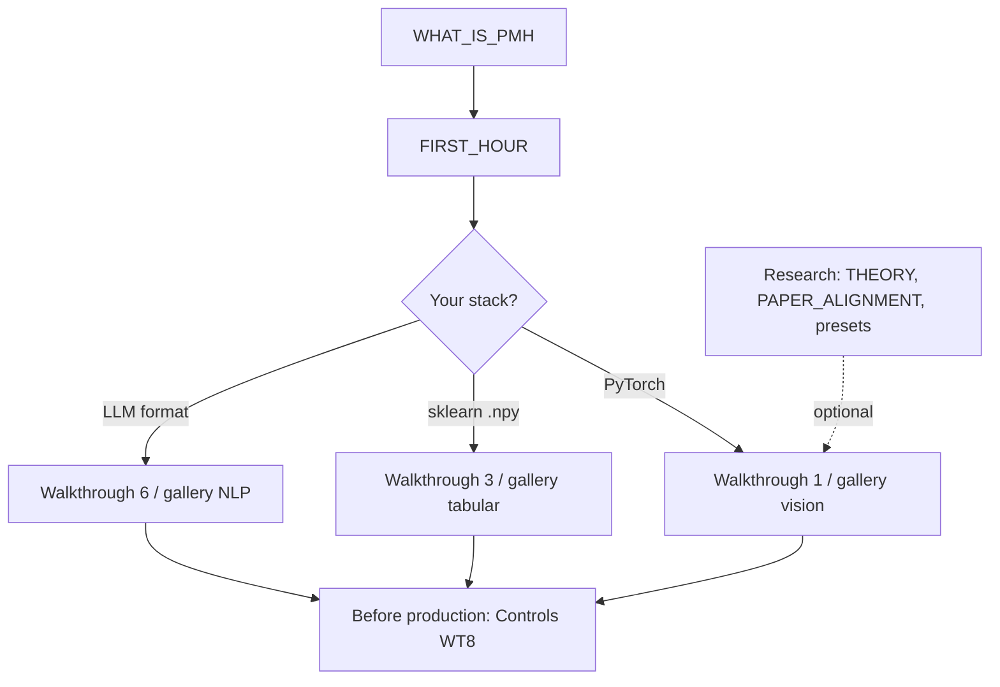

# Developer onboarding plan

**Goal:** A general ML engineer (no paper, no D1–D7 vocabulary) can get value in **under one hour** and integrate PMH in **one afternoon**.

**Principle:** Paper fidelity stays in **Advanced / Research** docs; the default path is **domain shift + PMHTrainer** or **PMHMatcher**.

---

## Phases

| Phase | Focus | Status |
|-------|--------|--------|
| **P0** | New front door, happy-path example, dev-first README/nav | **Shipped** (docs + example 00 + `pmh.onboarding`) |
| **P1** | Colab, troubleshooting glossary, gallery one-liners | **Shipped** (local) |
| **P2** | `pmh-train wizard`, PyPI description, sklearn README card | **Shipped** (local) |
| **P3** | Rename/alias APIs (`DomainRobustTrainer`), Hub sklearn pipeline card | Backlog |
| **Tier A–C (API)** | `robust_fit`, `check_applicability`, golden paths, starter, HF G3 | **Shipped** (local, v1.5.0) |

---

## P0 (shipped in docs + example 00)

| Deliverable | Purpose |
|-------------|---------|
| [WHAT_IS_PMH.md](WHAT_IS_PMH.md) | Plain language: train site A → deploy site B |
| [FIRST_HOUR.md](FIRST_HOUR.md) | Single path: install → run → copy snippet |
| `examples/00_first_run_domain_shift.py` | Prints baseline vs PMH target accuracy |
| `pmh.onboarding.recommend_setup` | 3 questions → snippet + next doc link |
| README + `docs/index.md` | Developer links first; theory/D1–D7 below fold |
| mkdocs **Start here** nav | Reordered: What is PMH → First hour → Getting started |
| Paper docs moved under **Research** tab | CORRECT_USAGE, PAPER_ALIGNMENT, presets |

**Success metric:** New user runs `python examples/00_first_run_domain_shift.py` and sees interpretable accuracy lines without reading THEORY.md.

---

## P1 (shipped locally)

| Deliverable | Location |
|-------------|----------|
| Colab notebook (Hospital A→B) | `notebooks/domain_shift_first_run.ipynb` · [COLAB.md](COLAB.md) |
| Troubleshooting glossary | [TROUBLESHOOTING.md#plain-language-glossary](TROUBLESHOOTING.md#plain-language-glossary) |
| Gallery “You have → do” intros | [gallery/](gallery/README.md) |

## P1 remainder (optional)

- **Colab for sklearn tabular** — frozen features path without PyTorch training loop.
- **Expand `recommend_setup`:** print Colab link when `stack=pytorch`.

---

## P2 (shipped locally)

| Deliverable | Location |
|-------------|----------|
| `pmh-train wizard` | `src/pmh/cli/main.py` + `pmh.onboarding.run_wizard` |
| PyPI short description + keywords | `pyproject.toml` (README = long description on upload) |
| sklearn **Pipeline** card | README + [gallery/tabular](gallery/tabular.md) |
| Preflight plain English | `preflight_plain_english()` · example `00` |
| Workflow diagram | README mermaid (replaces GIF for now) |

## P2 remainder (shipped locally)

| Deliverable | Location |
|-------------|----------|
| sklearn Colab | `notebooks/sklearn_frozen_features_first_run.ipynb` |
| Demo output preview (GIF substitute) | [DEMO_OUTPUT.md](DEMO_OUTPUT.md) |
| Error snippet table | [TROUBLESHOOTING.md#if-you-see-this-error-copy-paste](TROUBLESHOOTING.md#if-you-see-this-error-copy-paste) |

Optional later: record GIF into `docs/assets/` and embed in README.

---

## P3 (optional product)

- Public alias: document `PMHTrainer` as “domain-robust fine-tuning helper”.
- Hugging Face / timm integration posts linking to FIRST_HOUR only.

---

## Doc map (target information architecture)

---

## What we are **not** doing in P0

- Changing core estimator math or presets semantics.
- Removing D1–D7 from reference docs (only demoting in nav).
- Promising Office-31 headline wins on linear heads.

---

## Owners / checkpoints

- After P0: run user test — colleague with no paper reads WHAT_IS_PMH + runs example 00 only.
- After P1: Colab completes in &lt;3 min on free GPU or CPU fallback.
- Track issues tagged `onboarding` in GitHub.

See [ROADMAP.md](ROADMAP.md) for feature backlog; this file tracks **developer UX** only.
