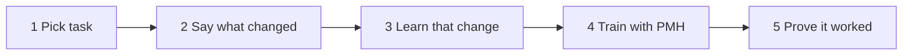

# Five-Step Workflow

Use this workflow when you want a model to work better in production than standard training alone: same task, same labels, different environment.



```
pick task -> say what changed -> learn that change -> train -> prove it worked
```

---

## Step 1 - Pick the Task

Start from the thing you are trying to improve:

- segmentation in a new city or scanner;
- pose estimation from a new camera angle;
- classification in a new hospital or geography;
- speech recognition in a new room or microphone;
- an LLM workflow with a new output format;
- frozen embeddings from a new customer group.

Then go to [Find my task](APPLICATIONS.md).

---

## Step 2 - Say What Changed

Write one sentence:

> We train on A, deploy on B, and the label still means the same thing.

Good:

- "Train on Hospital A images; deploy on Hospital B images; disease labels are the same."
- "Train on warehouse camera images; deploy on store cameras; product classes are the same."
- "Train on support tickets; deploy on chat transcripts; intent labels are the same."

Bad:

- "Deploy has new classes."
- "Hospital B uses a different disease definition."
- "We do not know what changes at deploy."

```bash
pmh-train route --search hospital
pmh-train route --search segmentation
pmh-train route --search pose
```

---

## Step 3 - Learn That Change From Data

PMH needs examples from training and production. Labels on production examples are useful for evaluation; they are not always required for learning the change.

```python
from pmh import robust_fit

pmh_run = robust_fit(
    model,
    train_loader,
    source_batches=source_loader,
    target_batches=target_loader,
    hook="auto",
)
print(pmh_run.preflight_message)
```

If PMH cannot see a stable production change in your features, it should say so before you make claims.

---

## Step 4 - Train With PMH

PMH does not replace your segmentation loss, classification loss, CTC loss, reward loss, or regression loss. It sits next to your normal loss and teaches the model to care less about the production change.

```python
from pmh import PMHConfig

config = PMHConfig.balanced()
```

Use the default settings first. Tune only after the production-like holdout says PMH is helping.

---

## Step 5 - Prove It Before Shipping

A better metric from one run is not enough. You need controls.

The evidence you want is:

> PMH improves the production-like holdout and beats wrong controls.

```python
from pmh import evaluate_robust_fit

report = evaluate_robust_fit(
    model,
    train_loader,
    deploy_holdout_loader,
    source_batches=source_loader,
    target_batches=target_loader,
    hook="auto",
    pmh_result=pmh_run,
)
print(report.summary())
```

For frozen features:

```python
from pmh import evaluate_baseline_vs_pmh

report = evaluate_baseline_vs_pmh(x_source, y_source, x_target, y_target)
print(report.summary())
```

---

## The Two Main Ways PMH Enters a Pipeline

| Pipeline | What PMH does | Start |
|----------|---------------|-------|
| Training or fine-tuning | Adds PMH beside your normal training loss | [Train/fine-tune recipe](GOLDEN_PATHS.md#train-or-fine-tune-a-model) |
| Existing embeddings / sklearn | Tests PMH on exported features without retraining the encoder | [Embeddings recipe](GOLDEN_PATHS.md#use-existing-embeddings-or-sklearn) |

LLM/text, Lightning, HF Trainer, and custom pipelines are variants of these two modes.

---

## What to Read Next

| Need | Page |
|------|------|
| One-page field guide | [ADOPT.md](../ADOPT.md) |
| Find your task | [APPLICATIONS.md](APPLICATIONS.md) |
| Copy code | [GOLDEN_PATHS.md](GOLDEN_PATHS.md) |
| Install / CLI / stack details | [INTEGRATE.md](INTEGRATE.md) |
| Paper examples and advanced settings | [walkthroughs/index.md](walkthroughs/index.md) |
