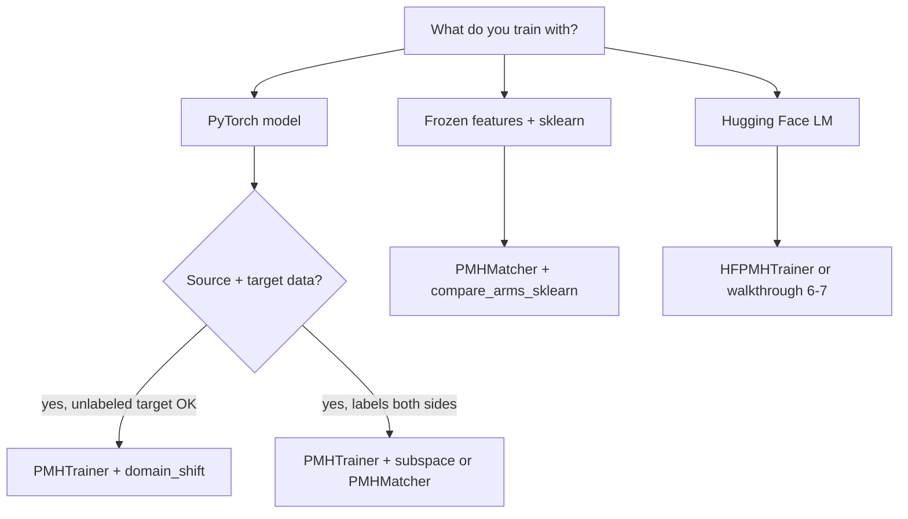

# Getting started (adoption guide)

**Goal:** add matched PMH to **your** model and **your** data in one afternoon—without reading the research paper.

---

## Step 0 — One sentence (required)

Write down what changes at deployment **without changing the label**:

> *Example:* “Images from a new hospital camera, but the disease label still means the same thing.”

If you cannot write this sentence, stop and read [Which nuisance type?](nuisance_types.md). PMH is not “make any dataset robust”; it is “regularize along **your** named deployment shift.”

---

## Step 1 — Pick your path (30 seconds)



| You are… | Start here | Copy-paste template |
|----------|------------|---------------------|
| PyTorch, two domains (vision, audio, …) | [Gallery: vision](gallery/vision.md) | `examples/01_domain_shift_d4.py` |
| sklearn / `.npy` features | [Gallery: tabular](gallery/tabular.md) | `examples/06_office31_sklearn.py` |
| LLM style / format drift | [Gallery: NLP](gallery/nlp.md) | `examples/08_hf_style_d7.py` |
| Not sure yet | [Choose your setup](CHOOSE_YOUR_SETUP.md) | — |

---

## Step 2 — Install

```bash
pip install matching-pmh torch
# optional:
pip install "matching-pmh[sklearn]"   # classical ML path
pip install "matching-pmh[hf]"        # D7 style JSONL
pip install "matching-pmh[vision]"    # ResNet / timm examples
```

Verify:

```bash
python -c "import pmh; print(pmh.__version__)"
pmh-train list-methods
```

---

## Step 3 — Minimal working example (PyTorch)

This is the **recommended** API: one object, Phase A + B.

```python
from pmh import PMHTrainer, PMHConfig

trainer = PMHTrainer(
    your_model,
    hook=your_backbone,          # nn.Module or "avgpool" / path string
    head=your_classifier,        # optional
    nuisance="domain_shift",     # or "auto" + data flags
    pmh_config=PMHConfig.balanced(),
    artifact_path="artifacts/my_sigma.pt",
)

trainer.fit(
    your_train_loader,
    source_batches=loader_site_a,   # deployment A (estimate)
    target_batches=loader_site_b,   # deployment B (estimate)
    epochs=20,
)

print("preflight:", trainer.artifact_.preflight)  # pass / marginal / fail
```

**Rules that matter:**

1. **`hook` must be the same** in estimate and train (same layer, same `d`).
2. **Save** `artifact_path` when you change data or hook.
3. Use **`PMHConfig.balanced()`** first; tune later.

→ Full detail: [Adapt your pipeline](ADAPT_YOUR_PIPELINE.md)

---

## Step 4 — Minimal example (sklearn / frozen features)

```python
from pmh import PMHMatcher, suggest_nuisance, compare_arms_sklearn

# Optional: pick nuisance from what you have
print(suggest_nuisance(has_target_labels=True, has_target_domain=True))

matcher = PMHMatcher(nuisance="domain_shift", rank=16)
matcher.fit(x_source, x_target)   # or fit(x_src, y_src, x_tgt, y_tgt) for D1

# Credible comparison table (B0 / matched / wrong-W / isotropic)
compare_arms_sklearn(x_source, y_source, x_target, y_target, report_dir="results/run1")
```

---

## Step 5 — Credible claims (do not skip)

Matched PMH must beat **wrong-W** and **isotropic** on a **deployment-like** metric—not only beat B0.

```python
from pmh import compare_arms

compare_arms(
    trainer.artifact_,
    model_factory=...,
    setup_model=...,
    train_loader=...,
    val_loader=...,              # prefer target-domain val
    report_dir="results/arms",
)
```

→ [Walkthrough 8 — Controls](walkthroughs/08-falsification-controls.md)

---

## Step 6 — Tune (only after it runs)

| Knob | Start | If… |
|------|-------|-----|
| `PMHConfig.balanced()` | default | — |
| `rank` | 16–32 | preflight `marginal` → try more data or D1 |
| `weight` / `cap_ratio` | presets | PMH dominates loss → `conservative()` |
| `nuisance` | `suggest_nuisance(...)` | unsure D1 vs D4 |

```python
from pmh.tune import tune_sklearn_matcher  # rank grid on frozen features
```

---

## Documentation map

| I need… | Read |
|---------|------|
| **This guide** | GETTING_STARTED.md (you are here) |
| **Which API for my stack?** | [CHOOSE_YOUR_SETUP.md](CHOOSE_YOUR_SETUP.md) |
| **Full integration checklist** | [ADAPT_YOUR_PIPELINE.md](ADAPT_YOUR_PIPELINE.md) |
| **Hook layer for ResNet / ViT / HF** | [hooks.md](hooks.md) |
| **D1 vs D4 vs D7 decision** | [nuisance_types.md](nuisance_types.md) |
| **Something broke** | [TROUBLESHOOTING.md](TROUBLESHOOTING.md) |
| **Math** | [THEORY.md](THEORY.md) |
| **Already use CORAL?** | [COMPARE_TO_CORAL.md](COMPARE_TO_CORAL.md) |
| **18 stack-specific tutorials** | [walkthroughs/index.md](walkthroughs/index.md) |

---

## What success looks like

- [ ] One-sentence nuisance story documented  
- [ ] Training runs with `task` and `pmh` losses both non-zero  
- [ ] `artifact.preflight` is `pass` or `marginal` (if `fail`, see troubleshooting)  
- [ ] **matched** beats **wrong_w** and **isotropic** on your deployment metric  
- [ ] `artifact` path saved in experiment config  

You do **not** need paper datasets, task IDs, or our model classes.
