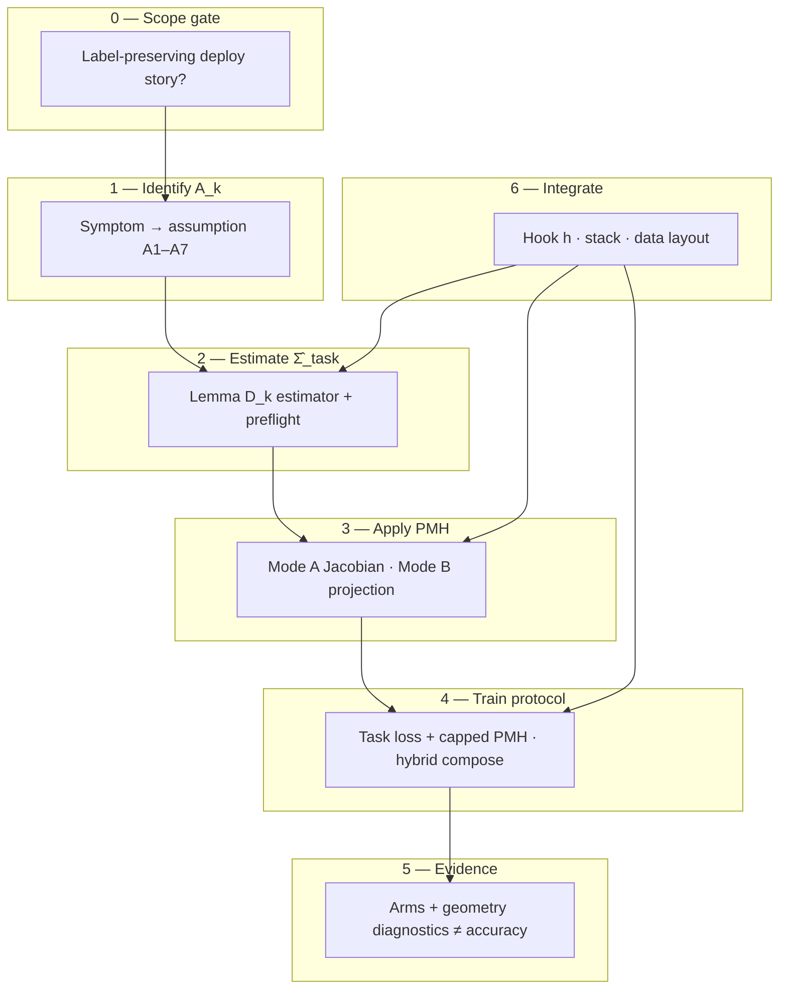

# Meta-structure (from the paper)

**Read this before reorganizing code or docs.**  
Source: *The Matching Principle* (`main.pdf`, §2–7, Figure 2, Figure 4, Tables 3–4).  
Implementation map: [ARCHITECTURE.md](ARCHITECTURE.md) (modules) · [THEORY.md](THEORY.md) (math bridge).

---

## What the paper actually sells

| Paper delivers | What it is **not** |
|----------------|-------------------|
| One object: \(\Sigma_{\mathrm{task}} = \mathrm{Cov}_{Q_n}(n)\) | Thirteen independent “methods” |
| One loss family: task loss + Jacobian trace along \(\Sigma' \supseteq \mathrm{range}(\Sigma_{\mathrm{task}})\) | A leaderboard DA toolkit |
| Seven **identification** lemmas D1–D7 under assumptions \(A_k\) | Seven product SKUs |
| Two **falsification** controls (wrong-\(W\), signal-\(W\)) + isotropic arm | “Add regularization and hope” |
| Five-step **recipe** (§7, Fig. 4) | Re-run of `Paper2/T1`…`T7` folders |

The thirteen blocks (T1–T7, some split A/B) are **pre-registered evidence** that the recipe behaves as Theorems A, B, C, E predict. Appendix B says explicitly: the **reference library** implements §7; **paper task folders are not required**.

**Global product goal:** any team with label-preserving deployment shift can run the **same pipeline** on **their** architecture—without speaking paper block IDs.

---

## The meta-structure (six layers)

This is the structure the package should expose—not “T3A” or “Office-31” as primary nouns.



### Layer 0 — Scope gate

**Paper:** Definition 2.1 (label preservation); §7.3 (when not to apply—causal shortcuts, no \(A_k\), large nonlinear break).

**Library today:** `check_applicability`, [WHEN_PMH_HELPS.md](WHEN_PMH_HELPS.md), task `verdict` in `task_router`.

**Global packaging:** first CLI/docs step is always “is \(\Sigma_{\mathrm{task}}\) defined for your deploy story?”—not “pick D4.”

---

### Layer 1 — Identify \(A_k\) (nuisance **family**)

**Paper:** Table 4 (symptom → \(A_k\)); §5.1 hybrid compose (additive penalties).

**Library today:** `suggest_subtype`, `SHIFT_TYPES`, `nuisance` keys, `catalog.METHODS`.

**Correct center of gravity:**

| User language | Paper | Library key |
|---------------|-------|-------------|
| “Camera / site look, same labels” | \(A_4\) | `domain_shift` → D4 |
| “Same classes, different geometry in features” | \(A_1\) | `subspace` → D1 |
| “Blur/crop/color modes I train on” | \(A_3\) | `augmentation` → D3 |
| “Only some coordinates move” | \(A_5\) | `compositional` → D5 |
| … | Table 3 row | `catalog` + `NUISANCE_SUBTYPES` |

**Do not** lead with block IDs (T4A, T7B). Blocks are **worked examples** of a row in Table 3.

---

### Layer 2 — Estimate \(\hat\Sigma_{\mathrm{task}}\) (Lemma D\(_k\))

**Paper:** Table 3 master index; eigengap pre-flight (§5.1); Lemmas D1–D7 are **conditional** consistency, not guarantees.

**Library today:** `estimate_sigma_task` / `estimate_from_config` → `SigmaTaskEstimate`; `preflight_eigengap`; `pmh.calibrate.*` for block-specific refinements.

**One artifact type everywhere:** `SigmaTaskEstimate` (saved `.pt`). Every estimator is a **plug-in** filling the same slot—matching §7.1 (“only block-specific choice is the estimator”).

**Calibrate modules** = optional refinements when default D\(_k\) under \(A_k\) is weak (e.g. gradient-SVD under \(A_3\), content-residual under \(A_6\)). Document as “estimator variants under the same lemma,” not parallel products.

**Predicted failures are features:** marginal eigengap → Office-31 pattern (CORAL can beat matched PMH). `preflight` + doctor should say that **before** the user blames the library.

---

### Layer 3 — Apply matched PMH (two modes)

**Paper:** Mode A = Jacobian penalty on \(h=\phi_\theta(x)\) (Eq. 4, §7.1); Mode B = subspace projection then task head (T1 classical).

| Mode | When | Library |
|------|------|---------|
| **A** | Deep training, any hook | `PMHLoss`, `PMHTrainer`, `robust_fit` |
| **B** | Frozen features / linear probe | `PMHMatcher`, `MatchedSubspaceProjector`, `compare_arms_sklearn` |

**Global rule:** same \(\hat\Sigma_{\mathrm{task}}\), different **application** operator. Docs and API should name **mode** explicitly, not bury it under “sklearn vs PyTorch.”

---

### Layer 4 — Training protocol

**Paper:** Step 4 cap (Prop. 3.5); hybrid nuisances = sum of capped terms; wrong-\(W\) ≈ isotropic (Lemma C).

**Library today:** `PMHConfig` (`cap_ratio`, `warmup_epochs`), `MultiPMHLoss`, `controls.wrong_W_projector`.

**Packaging:** “protocol” is not optional sugar—it is part of the **theorem-facing** API (`mode=` on `PMHLoss`).

---

### Layer 5 — Evidence (arms + geometry)

**Paper:** Step 5 wrong-\(W\) and signal-\(W\); §6 `tdi`, \(D_N/D_S\); §7.2 geometry ≠ task metric.

**Library today:** `compare_arms`, `validate_falsification`, `pmh.tdi`, `pmh.research`.

**Global reporting contract (three axes):**

1. **Task metric** on deploy holdout (accuracy, WER, …)
2. **Falsification arms** (matched vs wrong-\(W\) vs isotropic vs signal-\(W\) where applicable)
3. **Geometry** (`tdi`, \(D_N/D_S\))—never collapsed into one leaderboard number

**Tier 2 / `pmh.research`** exists for this layer—not for first-time adoption.

---

### Layer 6 — Integrate (your stack)

**Paper:** Architecture-agnostic \(\phi\); §7.1 twelve-line PyTorch is the mechanical core.

**Library today:** `hooks`, `integrations`, `task_router` (personas: pose, HF, sklearn, …).

**Role of “applications” / tasks:** integration **personas** (data layout + hook hint + example script)—they **bind** layers 1–6 for a job title, they do not replace \(A_k\) / D\(_k\).

---

## Five-step recipe = public API spine

Align docs, CLI, and Tier 0 API to the paper’s numbered recipe (Fig. 4):

| Step | Paper | User-facing entry |
|------|-------|-------------------|
| 1 | Identify \(A_k\) | `suggest_subtype` / `explain_task` / Table 4 in docs |
| 2 | Estimate \(\hat\Sigma_{\mathrm{task}}\) + preflight | `PMHTrainer.estimate` · `estimate_from_config` · `run_doctor` |
| 3 | Matched PMH | `PMHLoss` / `robust_fit` / `PMHMatcher` |
| 4 | Cap | `PMHConfig.balanced()` etc. |
| 5 | Controls | `compare_arms` · `PMHLoss(mode=...)` |

**Tier 0** should read as “Steps 1–3 in one call” (`robust_fit`, `PMHMatcher`) plus routing (`explain_task`). **Tier 1** = explicit steps. **Tier 2** = block presets and full benchmark protocol.

---

## How **not** to package (anti-patterns)

1. **Block-first nav** — “Start with T4 walkthrough” trains replication, not adoption.
2. **Estimator = product line** — D1–D7 are identification lemmas under one \(\Sigma_{\mathrm{task}}\), not seven apps.
3. **Matched-only demos** — §7.5: matched-only gains are inconclusive.
4. **Accuracy-only README** — T6A/T7B style dissociations are predicted; hide geometry → mistrust.
5. **Monorepo with paper trees** — [SEPARATION.md](../SEPARATION.md) is correct; keep evidence scripts out of `pip install`.

---

## Target package shape (code)

Current subpackages ([ARCHITECTURE.md](ARCHITECTURE.md)) map to meta-layers as follows:

| Meta-layer | Target module | Today |
|------------|---------------|--------|
| Scope + routing | `pmh.guide` | `task_router`, `developer`, `onboarding` |
| Identify | `pmh.core` + `pmh.estimators` + `pmh.calibrate` | `estimate`, `estimators/*` |
| Apply A | `pmh.train` | `trainer`, `training` |
| Apply B | `pmh.adapt` | `matcher`, `sklearn_*` |
| Protocol | `pmh.core.controls`, `pmh.config` | `controls`, `config`, `multi` |
| Evidence | `pmh.research` | `benchmark`, `compare`, `tdi` |
| Integrate | `pmh.integrations`, `pmh.hooks` | flat + `vision` |

Optional next rename (2.0): `pmh.identify`, `pmh.apply`, `pmh.evidence` as aliases—only after docs use meta-language consistently.

---

## Target doc shape (site) — implemented (v3 slim)

| Tab | Pages | Content |
|-----|-------|---------|
| **Adopt** | 6 | Recipe, Applications, Golden paths, Integrate, When PMH helps, Troubleshooting |
| **More** | 4 | D1–D7, custom geometry, CORAL, API index |
| **Evidence** | 3 | Walkthrough index, falsification, paper alignment |
| **Reference** | 2 | Estimators index, theory |

~60 removed pages; **redirects only in `mkdocs.yml`** (no stub files). **~39 markdown files** remain in `docs/`. Regenerate: `gen_compact_applications.py`, `gen_compact_nuisance_subtypes.py`.

---

## Checklist: “global-ready” release

- [x] README opens with five-step recipe + \(\Sigma_{\mathrm{task}}\), not D1–D7 list
- [x] Mode A/B doc ([MODES.md](MODES.md)); integration guides link from golden paths
- [x] Golden paths G1–G4 link falsification (walkthrough 08) per section
- [x] Block IDs under Evidence tab; Adopt leads with [FIVE_STEP_RECIPE.md](FIVE_STEP_RECIPE.md)
- [x] `pmh.recipe` + `preflight` messages (Office-31 pattern in `step_estimate`)
- [x] Paper repo separate ([SEPARATION.md](../SEPARATION.md)); `pmh-train recipe` CLI

---

## Relation to §7.1 (twelve lines of PyTorch)

The paper’s minimal implementation is:

```text
Sigma_hat from Lemma D_k  →  pmh_penalty(encoder, x, Sigma_hat)  →  task_loss + λ * penalty
```

`matching-pmh` already decomposes this into `estimate_*` + `pmh_penalty_on_rep` / `PMHLoss` + `cap_pmh_term`. **Packaging win:** document that **every** block in §8 is that snippet with a different `Sigma_hat` factory—not a different training paradigm.

---

## Summary

**Correct global packaging** = export the **matching-principle pipeline** (scope → \(A_k\) → D\(_k\) → \(\hat\Sigma_{\mathrm{task}}\) → capped PMH → falsification + geometry), with **tasks** as integration shortcuts and **T-blocks** as evidence cards.

**Incorrect packaging** = organize the library like the paper’s experiment tree (replicate T1, T3A, …).

Next implementation passes should align names and nav to this meta-structure—not add more block walkthroughs.
