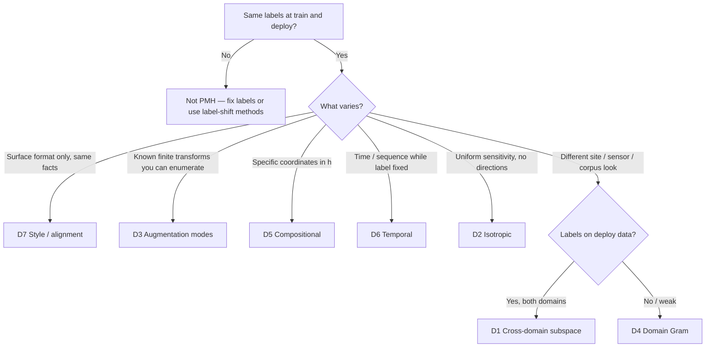

# Nuisance subtypes (D1–D7)

**Pick the structural type of deployment shift first.** Paper tasks T1–T7 are **worked examples** of these subtypes—not a menu of thirteen separate tools.

Every subtype uses the same pipeline:

**Estimate** \(\hat\Sigma_{\mathrm{task}}\) → **Apply** PMH → **Validate** with controls

See [product plan](NUISANCE_SUBTYPE_PLAN.md) · [Identification fidelity](FIDELITY_BY_SUBTYPE.md) · [When PMH helps](WHEN_PMH_HELPS.md) · [Golden paths](GOLDEN_PATHS.md)

---

## Decision tree



**Quick Python check:**

```python
from pmh import suggest_nuisance

sug = suggest_nuisance(
    has_source_labels=True,
    has_target_labels=False,      # set True if you have deploy labels
    has_target_domain=True,
    has_augmentation_modes=False, # True if you have aug deltas
    has_style_pairs=False,
    has_temporal_sequences=False,
    has_nuisance_indices=False,
)
print(sug.method, sug.nuisance, sug.reason)
```

**Interactive:** `pmh-train wizard` (asks stack + shift type)

---

## The seven subtypes

### D1 — Cross-domain subspace {#d1-cross-domain-subspace}

| | |
|---|---|
| **Similar structure** | Same classes; **different domains** shift features along a **low-rank subspace** (site A vs B) |
| **You need** | Features \(h\) on source **and** target; **class labels on both** |
| **Estimate** | Class-aligned cross-domain SVD + mean shifts |
| **Apply** | Often **Mode B** (projection + sklearn) or Mode A on deep \(h\) |
| **Default API** | `nuisance="subspace"` · `SigmaTaskConfig.for_subspace(rank=...)` |
| **Paper exemplar** | T1 (Office-31, ridge) — [recipe](recipes/t1-office31-d1.md) |
| **Not this if** | No target labels → use **D4**; new classes at deploy → not PMH |

```python
from pmh import estimate_from_config, SigmaTaskConfig
artifact = estimate_from_config(
    SigmaTaskConfig.for_subspace(rank=32),
    x_src, y_src, x_tgt, y_tgt,
)
```

---

### D2 — Isotropic {#d2-isotropic}

| | |
|---|---|
| **Similar structure** | Nuisance is **uniform** sensitivity (σ²I); no learned subspace directions |
| **You need** | Representation dimension; noise level σ |
| **Estimate** | Fixed isotropic Σ |
| **Apply** | **Mode A** on hook (ViT CLS, embeddings) |
| **Default API** | `nuisance="isotropic"` |
| **Paper exemplar** | T2A ViT — [recipe](recipes/t2a-vit-isotropic.md) |
| **Controls** | Paper often uses **ERM vs PMH only** (no wrong-W arm) |

---

### D3 — Augmentation modes {#d3-augmentation-modes}

| | |
|---|---|
| **Similar structure** | Nuisance spans a **finite set of known transforms** (modes); Σ from augmentation-induced deltas |
| **You need** | Stack of per-mode deltas `[K, N, d]` or `[K, d]` |
| **Estimate** | Gram over modes |
| **Apply** | **Mode A** |
| **Default API** | `nuisance="augmentation"` · `aug_deltas=` · `collect_augmentation_deltas` |
| **Paper exemplar** | T3B depth (photometric aug); T3A often uses **gradient-based W** (same subtype family, richer identification) |
| **Refinement** | `pmh.calibrate.gradient_subspace_numpy(gradients)` when W comes from input gradients |

---

### D4 — Domain Gram {#d4-domain-gram}

| | |
|---|---|
| **Similar structure** | **Domain** difference in feature space; **target labels not required** |
| **You need** | Source batches + target batches (same \(h\) hook) |
| **Estimate** | Centred source − target Gram (optional rank truncate) |
| **Apply** | **Mode A** (default product path G1) |
| **Default API** | `nuisance="domain_shift"` |
| **Paper exemplar** | T4 vision DA — [recipe](recipes/t4-domain-d4.md) |
| **Multilayer** | `MultiLayerPMHLoss` when shift appears at several hooks |

```python
from pmh import PMHTrainer, PMHConfig
trainer = PMHTrainer(model, hook=hook, nuisance="domain_shift", pmh_config=PMHConfig.balanced())
trainer.fit(train_loader, source_batches=src, target_batches=tgt, epochs=20)
```

---

### D5 — Compositional {#d5-compositional}

| | |
|---|---|
| **Similar structure** | Nuisance lives in **known coordinates** of \(h\) (positions, token blocks, nodes) |
| **You need** | `nuisance_indices` listing which dims are nuisance |
| **Estimate** | Block covariance on those coordinates |
| **Apply** | **Mode A** |
| **Default API** | `nuisance="compositional"` · `nuisance_indices=(...)` |
| **Paper exemplar** | T5A QM9, T5B code tokens |
| **You bring** | Index map from your schema—library does not infer it |

---

### D6 — Temporal / sequence {#d6-temporal-sequence}

| | |
|---|---|
| **Similar structure** | Label-constant variation along **time** or sequences |
| **You need** | `[N, T, d]` trajectories or precomputed residuals |
| **Estimate** | Scatter of temporal / consecutive differences |
| **Apply** | **Mode A** |
| **Default API** | `nuisance="temporal"` · `sequences_batches=` |
| **Paper exemplar** | T6B HAR; T6A Whisper uses **content-residual** identification (refinement) |
| **Refinement** | `pmh.calibrate.content_residual_subspace(sequences, source="content"|"temporal")` |

---

### D7 — Style / alignment {#d7-style-alignment}

| | |
|---|---|
| **Similar structure** | Same **semantic content**, different **surface form** (format, tone, template) |
| **You need** | Style-pair JSONL or embedding deltas; or two corpora (HF path) |
| **Estimate** | Gram of style-induced representation deltas |
| **Apply** | **Mode A** (HF Trainer, DPO, etc.) |
| **Default API** | `nuisance="style"` · `style_jsonl` · `HFPMHTrainer.estimate_style` |
| **Paper exemplar** | T7A LLM — [recipe](recipes/t7a-style-d7.md); T7B PGD-δ (delta stack + calibrator) |

---

## Application modes (all subtypes)

| Mode | When | API sketch |
|------|------|------------|
| **A — Jacobian** | Fine-tune PyTorch (or HF) on \(h\) | `PMHTrainer` + `PMHLoss` |
| **B — Projection** | Frozen features + linear/sklearn head | `PMHMatcher`, `compare_arms_sklearn` |

**Controls (credibility):** matched vs **wrong-W** (⊥ matched) vs isotropic / task negatives — [Walkthrough 8](walkthroughs/08-falsification-controls.md)

---

## Paper blocks → subtypes (reference only)

| Block | Primary subtype | Notes |
|-------|-----------------|-------|
| T1 | **D1** | Mode B; pool/test protocol for benchmarks |
| T2A/B | **D2** | Embedding / input noise |
| T3A/B | **D3** (+ gradient refinement) | Aug-delta or gradient-SVD |
| T4A/B | **D4** | Often multilayer |
| T5A/B | **D5** | User-defined indices |
| T6A/B | **D6** | 6A: content-residual refinement |
| T7A/B | **D7** | 7B: PGD deltas |

Replication detail: [PAPER_ALIGNMENT.md](PAPER_ALIGNMENT.md) · presets: `pmh-train list-presets`

---

## Anti-patterns

| Mistake | Fix |
|---------|-----|
| Using **D1** without target labels | Use **D4** |
| `nuisance="augmentation"` for pure site shift | Use **D4** or **D1** |
| Expecting one `nuisance=` string to match every paper script | Pick **subtype**, then optional **calibrator** |
| Skipping falsification arms | Run controls before claims — [WHEN_PMH_HELPS](WHEN_PMH_HELPS.md) |

---

## Next steps

| Goal | Doc |
|------|-----|
| Install and demo | [FIRST_HOUR.md](FIRST_HOUR.md) |
| Stack-specific copy-paste | [GOLDEN_PATHS.md](GOLDEN_PATHS.md) |
| API reference per method | [estimators/](estimators/index.md) · `pmh-train list-methods` |
| Research / benchmarks | [PAPER_ALIGNMENT.md](PAPER_ALIGNMENT.md) |
