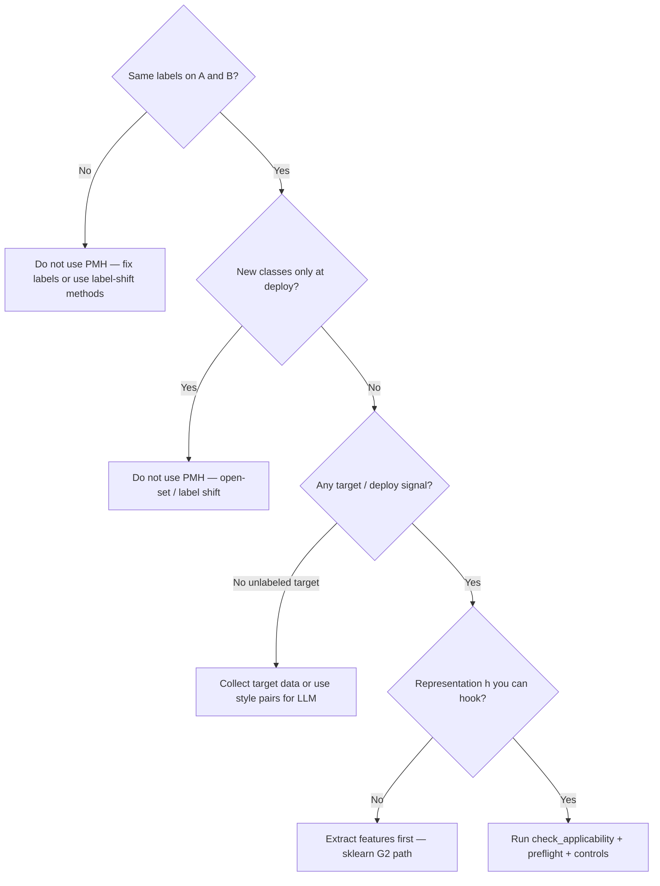

# When PMH helps (and when it does not)

!!! tip "Adoption path"
    First: [Find your application](APPLICATIONS.md) (does your task fit?). This page: honest expectations.

Honest expectations before you invest integration time. PMH is **not** a guarantee of higher accuracy; it is a **structured** way to reduce sensitivity along estimated deployment nuisance directions, with **falsification controls** so you can see whether gains are specific or generic.

---

## Quick decision



```python
from pmh import check_applicability

print(check_applicability(
    stack="pytorch",  # or "sklearn" / "hf"
    n_source=500,
    n_target=200,
    has_target_labels=False,  # unlabeled target OK for estimation
).summary())
```

---

## When you are more likely to see a benefit

| Signal | Why |
|--------|-----|
| **Clear domain shift** (camera, site, corpus style) with **same semantics** | PMH estimates directions that vary between A and B but should not change the label |
| **Enough target data to estimate geometry** | Rule of thumb: **50+** unlabeled target samples; **200+** for stable D1/D4; more for high rank |
| **ERM underperforms on target** but source training looks fine | Room to move the representation without destroying source fit |
| **Preflight passes** (`pass` or strong eigengap) | Estimated nuisance subspace is identifiable — see [TROUBLESHOOTING](TROUBLESHOOTING.md) |
| **Matched beats wrong-W and isotropic** in your control table | Gain is tied to the estimated nuisance story, not arbitrary regularization |
| **End-to-end fine-tuning** (Mode A) with a hook on `h` | Jacobian penalty can change what ERM alone cannot on frozen linear probes |

**Toy sanity check:** `python examples/00_first_run_domain_shift.py` — synthetic shift where PMH often **beats** ERM on target accuracy in one minute on CPU.

---

## When not to expect much (or use something else)

| Situation | What usually happens | Better approach |
|-----------|----------------------|-----------------|
| **Frozen features + linear head** on an easy DA benchmark | Small or **no** accuracy gain; CORAL may match or beat projection | See Office-31 table below; try Mode A fine-tuning if possible |
| **Very small target pool** (< ~30) | Unstable \(\hat W\), marginal preflight | More target data, lower rank, or simpler nuisance (D2/D4) |
| **Target already near source accuracy** | Little headroom | ERM + report that PMH was unnecessary |
| **Label shift / new classes** | PMH is the wrong tool | Open-set, class-balanced reweighting, separate heads |
| **Only generic noise robustness** | Isotropic arm may look similar to matched | Augmentation, adversarial training |
| **No target domain at all** | Cannot estimate deployment nuisance | Collect unlabeled target batches |

---

## Honest reference numbers (do not cherry-pick)

### Office-31 (T1, frozen ResNet-18 features, Amazon → DSLR)

Protocol: `paper_protocol=True`, preset `t1_office31_sklearn`, rank 32. **Paper:** [PAPER_ALIGNMENT](PAPER_ALIGNMENT.md) · Office-31 walkthrough: [19-office31-real-data](walkthroughs/19-office31-real-data.md).

| Arm | Target accuracy (holdout) | Comment |
|-----|---------------------------|---------|
| B0 (ERM) | **0.224** | Baseline |
| Matched PMH | **0.216** | Slightly *below* B0 on accuracy alone |
| CORAL | **0.268** | Strong on this **linear** frozen-feature setup |
| Isotropic control | 0.184 | Different objective — not “free accuracy” |

**Takeaway:** On this benchmark, **matched projection does not beat ERM accuracy**; CORAL is competitive. PMH is still useful here for **replication**, **geometry metrics** (TDI, \(D_N/D_S\)), and **falsification** (wrong-W should not beat matched on both accuracy and geometry). Do **not** use this table as a marketing headline.

### Synthetic domain shift (example 00)

Controlled shift in input space + trainable backbone — PMH often shows **higher target accuracy than ERM** because the representation can move. This is the right mental model for **Mode A** end-to-end training.

---

## PMH vs other approaches (same goal, different lever)

| Approach | What moves | Controls built in? | Typical best when |
|----------|------------|--------------------|-------------------|
| **ERM (source only)** | Task loss on A | — | Strong baseline; document target metric |
| **Fine-tune on target** | All weights on labeled B | — | Many target labels available |
| **CORAL / moment match** | Feature covariance toward target | Optional baseline arm | Frozen features + linear classifier |
| **DANN / domain adversary** | Encoder vs domain classifier | External | Unlabeled target, classic DA setup |
| **matching-pmh (matched)** | Penalize sensitivity along \(\hat\Sigma_{\mathrm{task}}\) | **wrong-W, isotropic** arms | Same labels, target signal, hook on `h`, need credible claim |

See [COMPARE_TO_CORAL.md](COMPARE_TO_CORAL.md) for migration notes.

---

## How to know it “worked” (beyond accuracy)

1. **Preflight** — `pass` before large training runs ([glossary](TROUBLESHOOTING.md#plain-language-glossary)).
2. **Target metric** — accuracy / AUROC on held-out **target**, not source only.
3. **Falsification** — [Walkthrough 8](walkthroughs/08-falsification-controls.md): matched > wrong-W on deployment metric; isotropic should not beat matched on **both** accuracy and geometry.
4. **Geometry (optional)** — `tdi_cls`, \(D_N/D_S\) from `pmh.tdi` / benchmarks ([BENCHMARKS.md](BENCHMARKS.md)).

```python
# sklearn (frozen features)
from pmh import evaluate_baseline_vs_pmh

report = evaluate_baseline_vs_pmh(
    x_source, y_source, x_target, y_target,
    compare_to=("coral",),
)
print(report.summary())

# PyTorch (ERM vs PMH on labeled target val_loader)
from pmh import evaluate_robust_fit

report = evaluate_robust_fit(
    model, train_loader, val_loader,
    source_batches=src, target_batches=tgt,
    hook="auto", head=classifier, epochs=10,
)
print(report.summary())
# Then: compare_arms(...) for matched / wrong_w / isotropic
```

---

## Minimum checklist before production claims

- [ ] `check_applicability` is **go** (not `no_go`)
- [ ] Target holdout evaluated with **same label space** as source
- [ ] **Matched** compared to **B0** and at least one control arm
- [ ] If only isotropic wins, treat as generic regularization
- [ ] Report **protocol** (Mode A vs B, rank, pool size) for reproducibility

---

## Next steps

| Goal | Doc |
|------|-----|
| Install and first run | [INTEGRATE.md](INTEGRATE.md) |
| Pick PyTorch / sklearn / HF | [GOLDEN_PATHS.md](GOLDEN_PATHS.md) |
| Paper-faithful benchmarks | [CORRECT_USAGE.md](CORRECT_USAGE.md) · [PAPER_ALIGNMENT.md](PAPER_ALIGNMENT.md) |
| Errors | [TROUBLESHOOTING.md](TROUBLESHOOTING.md) |
