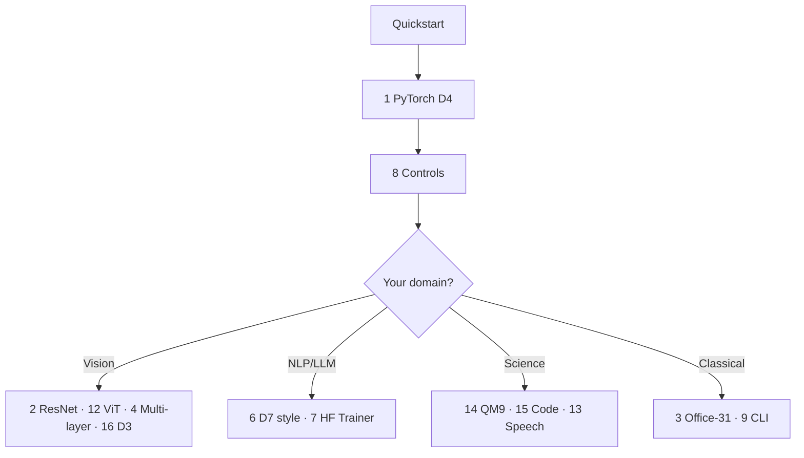

# Walkthroughs

**16 end-to-end guides** from nuisance story → estimate $\Sigma_{\mathrm{task}}$ → train → falsify.  
Each links to a **runnable** script in `examples/`.

| # | Walkthrough | Est. | Stack / paper block | Script |
|---|-------------|------|---------------------|--------|
| 1 | [PyTorch domain shift (D4)](01-pytorch-domain-d4.md) | D4 | Any `nn.Module` | `01_domain_shift_d4.py` |
| 2 | [ResNet hook + D4](02-resnet-vision-d4.md) | D4 | torchvision (T2) | `12_resnet_hook_d4.py` |
| 3 | [Office-31 + sklearn (D1)](03-office31-sklearn-d1.md) | D1 | Frozen features (T1) | `06_office31_sklearn.py` |
| 4 | [Multi-layer ConvNet](04-multilayer-convnet.md) | D3/D4 | CNN maps (T2) | `07_vision_multilayer.py` |
| 5 | [Compositional D5](05-compositional-d5.md) | D5 | Coords / tokens | `03_…`, `13_…` |
| 6 | [LLM style D7](06-llm-style-d7.md) | D7 | HF JSONL (T7A) | `08_hf_style_d7.py` |
| 7 | [HF Trainer + DPO](07-hf-trainer-d7-dpo.md) | D7 | LoRA / Qwen | `10_…`, `11_…` |
| 8 | [Falsification controls](08-falsification-controls.md) | * | All blocks | `04_falsification_controls.py` |
| 9 | [CLI JSON jobs](09-cli-json-jobs.md) | * | HPC / repro | `pmh-train` |
| 10 | [Lightning](10-lightning.md) | D4 | Lightning | `09_lightning_module.py` |
| 11 | [Temporal D6](11-temporal-d6.md) | D6 | HAR / sensors (T6B) | API |
| 12 | [ViT CLS + D4](12-vit-cls-d4.md) | D4 | ViT patch/CLS (T2) | `14_vit_cls_d4.py` |
| 13 | [Speech / Whisper D4](13-speech-whisper-d4.md) | D4 | ASR encoder (T6A) | `15_speech_encoder_d4.py` |
| 14 | [QM9 molecules D5](14-qm9-molecule-d5.md) | D5 | GNN (T5A) | `16_qm9_molecule_d5.py` |
| 15 | [Code tokens D5](15-codebert-tokens-d5.md) | D5 | CodeBERT (T5B) | `17_code_tokens_d5.py` |
| 16 | [Augmentations D3](16-augmentation-d3.md) | D3 | Photometric (T2) | `18_augmentation_d3.py` |

---

## Suggested learning path

1. [QUICKSTART.md](../QUICKSTART.md) — 10 minutes  
2. [Walkthrough 1](01-pytorch-domain-d4.md) — core two-phase loop  
3. [Walkthrough 8](08-falsification-controls.md) — credible claims  
4. Pick one row from the table for your stack  

---

## Theory & integration

- [THEORY.md](../THEORY.md) — mathematics  
- [ARCHITECTURES.md](../ARCHITECTURES.md) — hook points  
- [PHILOSOPHY.md](../PHILOSOPHY.md) — API design  
- [examples/README.md](../../examples/README.md) — script catalog  
