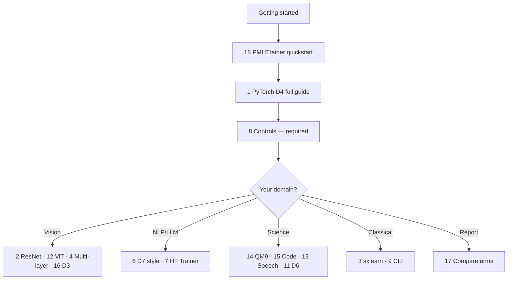

# Walkthroughs (full adoption guides)

Each walkthrough is a **complete guide** to adapt PMH to **your** task: prerequisites, nuisance examples, step-by-step code with `YOUR_*` placeholders, runnable scripts, worksheets, and controls.

**New here?** Read [Getting started](../GETTING_STARTED.md), then pick **one** row below.

**Stack-agnostic fill-in:** [Adaptation workbook](../ADAPTATION_WORKBOOK.md)  
**Guide format (for contributors):** [GUIDE_FORMAT.md](GUIDE_FORMAT.md)

---

## How to use these guides

1. Write your [one-sentence nuisance](../GETTING_STARTED.md#step-0--one-sentence-required).
2. Pick the closest walkthrough (table below).
3. Run the linked **example script** unchanged.
4. Copy the **Adaptation worksheet** section into your repo notes.
5. Complete [Walkthrough 8 — Controls](08-falsification-controls.md) before any public claim.

---

## Walkthrough index

| # | Guide | Est. | You need | Script |
|---|-------|------|----------|--------|
| 1 | [PyTorch domain shift (D4)](01-pytorch-domain-d4.md) | D4 | PyTorch model · preset `t4_domain_d4` | `01_domain_shift_d4.py` |
| 2 | [ResNet / torchvision D4](02-resnet-vision-d4.md) | D4 | Image folders, ResNet hook | `12_resnet_hook_d4.py` |
| 3 | [Frozen features + sklearn (D1)](03-office31-sklearn-d1.md) | D1 | `.npy` or extract features · preset `t1_office31_sklearn` | `06_office31_sklearn.py` |
| 19 | [**Office-31 real data**](19-office31-real-data.md) | D1 | Download images outside repo · T1 table | `download_office31.py`, `21_…` |
| 4 | [Multi-layer CNN](04-multilayer-convnet.md) | D3/D4 | Multi-scale feature maps | `07_vision_multilayer.py` |
| 5 | [Compositional D5](05-compositional-d5.md) | D5 | Known nuisance indices | `03_…`, `13_…` |
| 6 | [LLM style D7](06-llm-style-d7.md) | D7 | Style JSONL · preset `t7a_style_d7` | `08_hf_style_d7.py` |
| 7 | [HF Trainer + DPO](07-hf-trainer-d7-dpo.md) | D7 | HF Trainer, preferences | `10_…`, `11_…` |
| 8 | [**Falsification controls**](08-falsification-controls.md) | * | Any pipeline | `04_…`, `06_…`, `20_…` |
| 9 | [CLI JSON jobs](09-cli-json-jobs.md) | * | HPC / configs | `pmh-train` |
| 10 | [Lightning](10-lightning.md) | D4 | `LightningModule` | `09_lightning_module.py` |
| 11 | [Temporal D6](11-temporal-d6.md) | D6 | `[N,T,d]` sequences | API |
| 12 | [ViT CLS D4](12-vit-cls-d4.md) | D4 / T2A D2 | timm / ViT · preset `t2a_vit_isotropic` | `14_vit_cls_d4.py` |
| 13 | [Speech encoder D4](13-speech-whisper-d4.md) | D4 | Audio encoder | `15_speech_encoder_d4.py` |
| 14 | [QM9 / molecules D5](14-qm9-molecule-d5.md) | D5 | Compositional feats | `16_qm9_molecule_d5.py` |
| 15 | [Code tokens D5](15-codebert-tokens-d5.md) | D5 | Token blocks | `17_code_tokens_d5.py` |
| 16 | [Augmentations D3](16-augmentation-d3.md) | D3 | Named augs | `18_augmentation_d3.py` |
| 17 | [Compare arms (your pipeline)](17-compare-arms-your-pipeline.md) | * | Working PMH train | `20_compare_training_arms.py` |
| 18 | [PMHTrainer quickstart](18-pmh-trainer-quickstart.md) | * | PyTorch | `01_domain_shift_d4.py` |

---

## Suggested learning path

| Order | Doc | Why |
|-------|-----|-----|
| 1 | [GETTING_STARTED.md](../GETTING_STARTED.md) | Install + mental model |
| 2 | [18 — PMHTrainer](18-pmh-trainer-quickstart.md) | Shortest working code |
| 3 | [1 — PyTorch D4](01-pytorch-domain-d4.md) | Deepest default path |
| 4 | [8 — Controls](08-falsification-controls.md) | Credible claims |
| 5 | One domain row from the table | Your stack |

---

## Related docs

| Doc | Role |
|-----|------|
| [ADAPTATION_WORKBOOK.md](../ADAPTATION_WORKBOOK.md) | Generic worksheets |
| [ADAPT_YOUR_PIPELINE.md](../ADAPT_YOUR_PIPELINE.md) | D1–D7 checklist |
| [hooks.md](../hooks.md) | ResNet, ViT, HF |
| [BENCHMARKS.md](../BENCHMARKS.md) | Accuracy + TDI tables |
| [Paper presets by block](paper-presets-by-block.md) | `t1_office31_sklearn`, `t4_domain_d4`, `t7a_style_d7`, … |
| [examples/README.md](https://github.com/vishalstark512/matching-pmh/blob/main/examples/README.md) | Script catalog |
